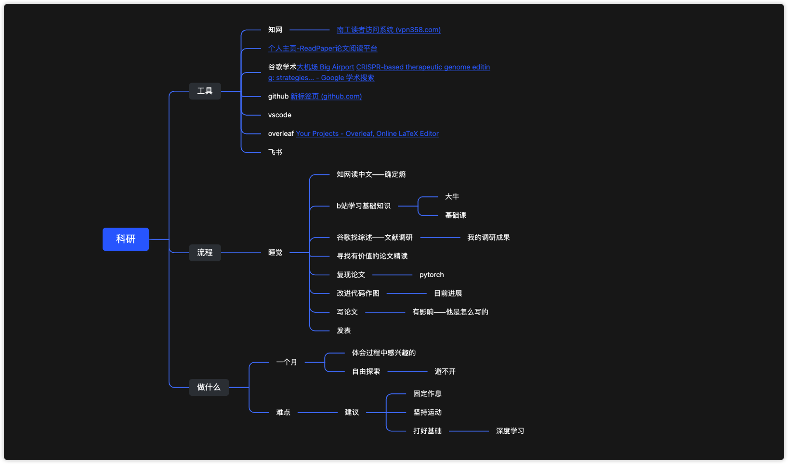

# 科研流程分享 - 2022计软院团委

> 讲座时间：大二 (2022) 第十一周周三 (11.9) 晚上 19:00
>
> 面向群体：全校师生(需要3科创分分), IT创客俱乐部的同学（需要得到IT社培训, 并主持项目的），其他同学（有学术兴趣和追求, 对读研读博迷茫) ）
>
> 作者：智能2111 [沈超凡](https://github.com/jarrycf/)
>
> 课程录屏 [b站-南工院IT社](https://space.bilibili.com/1352921332)

## 开场

活动马上开始, 请大家保持手机静音, 活动预计20:00结束, 我是IT社的副社长沈超凡

为了防止讲座被打断，我不会在讲座的过程中看腾讯会议和微信的聊天。当然为了防止特殊情况的发生，我提前跟一些同学说好，如果突然翻车了短信联系我hh。

大家如果在讲座的过程中有疑问，可以在讲座休息的间隙或者讲座结束后来找我问问题。鼓励大家多思考，多提问题。这也是我第一次讲将科研相关的内容，可能也会有一些地方设计的不太好，大家有建议也欢迎在分享会后跟我反馈。

## 我为什么要做科研

-20230607103549672.(null))

## 我科研到底要干些什么

-20230607103529555.(null))

-20230607103529751.(null))

-20230607103529599.(null))

-20230607103529546.(null))

## 我究竟适不适合科研

## 我改如何为科研做准备

## 好用的科研工具分享

## 科研人的一周作息分享

看完了这些工具可能大家会有这样的困惑：为什么我要做科研，我适不适合做科研，科研都干什么，我现在有能干什么

首先我们先弄清楚需求

我为什么要做科研

想从事科研的原因一般只有两个：

第一个原因呢就是你有学术理想，但这样的很少

另一种就是我们这样的大部分人，其实都会接受的一个现实，尤其是中国目前的环境，连任正非都开始吹寒气了，有个班上就不错了，本科学历找不到工作，那只能通过提升学历来提升竞争力，去找到一份好工作。大家都知道要完成你的硕士毕业论文，是不得不从事科研，甚至你毕业工作后，应聘到研发岗，那你的工作内容是科研。所以如果你有这样的打算，现在开始了解科研是没错的。

下面我们弄清楚自己

我究竟适不适合科研？

一般来讲，大部分人他是不适合做科研的，他只是可以做，但不代表他适合做。如果你真的觉得自己适合科研，可以找一位有课题的老师，浅浅感受一下，那位老师会push你，推着你跟上进度，到时候你就知道自己适不适合了。

如果你前两关都通过了，我真的适合做科研或者想做，

那你就要弄清除科研

科研到底要干些什么？

大家可能会刷到一些炒作的学术新闻，但不要被这些影响，我们做科研只有一个目的，就是为了推动我们想做的这个领域，哪怕一点一滴的发展，而不是为了发文章，即使你发了再多的文章都没有用，有的论文即使发表了，也没有人会看的，因为它一点价值都没有。如果你们是真心想做科研，我是不推荐你们这么干的，但如果你只是想找个班上，拿个二本的教职。那这么做也可以，哈哈，因为现在中国的评价体系就是，它只看你论文嘛，至少十年内这个评价体系是不会有太大变化的。

那接下来就是要为科研做些准备了

另外一些？

1. google
2. 大科学时代，搞科研也不再单打独斗
3. 生活与工作
4. 大一学数学：线面积分，二次型， 参数估计 以及一些idea的积累。

-20230607103910739.(null))

-20230607103910475.(null))

-20230607103910580.(null))

-20230607103910563.(null))

尧老师最近事有点多，大家有什么问题的话可以来问我。

，你们的卞勇康学长也是助理之一，所以我其实是来应援的。

尧老师其实已经讲得很全面了，我上来呢，主要是尧老师希望我以一个学生，一个项目参与者的视角来和大家分享一个做科研，做一个项目的历程，这其中有许多收获和教训，大家可以当成听故事来借鉴一下。

我是怎么接触到这个项目的呢？那得回到我大一下学期学期末6月份初，我很警惕一件事：考完试回家后的2个月整天手机玩到昼夜颠倒，刚好这个项目在暑假每周要开组会，可以有点事做，都是玩，不如玩点有意义的。

6月中旬考试结束放暑假，到8月中旬8周，共计8次组会，在这8周我们的项目是如何推进的，我们遇到了哪些阻碍，又是如何推进的。

第一周：在离校前尧老师给我提了一个要求是，在半年的时间里给他讲清楚一篇我们研究领域的重要论文，然后我就得到了这篇论文的题目，为了能读懂这篇全英的论文，尧老师希望我先从中文相关的论文读起，又给了我一个篇中文的论文题目叫做

BE-dot：为单碱基编辑设计sgRNA及预测脱靶图谱的工具，是北京协和的医生王泽鲁的硕士毕业论文顺带发表的一篇小论文，论文主要讲的就是由代码写出的一个工具be-dot，所以下面我们就简称这篇论文叫BE-dot

第一次读论文我就是这个感觉，写的好厉害，能写那么多字，又能让人每一句话读得懂。离校前尧老师教了我第一种科研的方法，我又找了一些相关的文献读了读，把重要的问题记了下来。然后我锁定了很关键的问题什么是单碱基编辑？这个问题不好回答，然后我b站up主们的科普下，问题又变成了2020年的化学诺贝尔奖CRISPR基因编辑是什么？单碱基编辑就是crispr/cas9发展而来的，为了弄懂crispr的技术原理，在b站跟着李林学习高中生物的经典遗传学，TED看大牛演讲，YouTube上。

并不是所有都适合做科研的，你不确定可以找个老师试一下

要注重积累，长时间的积累，你能跑到的一个深度学习的框架，你应该需要积累

合作

-20230607103910716.(null))

B站看了各种学说，各种版本，形成了我自己的认识

