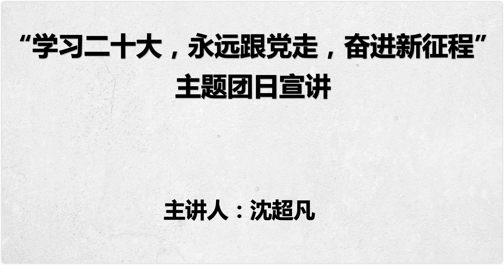

# 二十大文化布局宣讲 - 2022计软院团委

> 讲座时间：大二 (2022) 第十一周周六 (11.12) 晚上 19:00
>
> 面向群体：IT创客俱乐部的同学（需要5思想分），其他同学（有共产主义理想, 想要了解马克思主义中国化最新成果）
>
> 作者：智能2111 [沈超凡](https://github.com/jarrycf/)
>
> 课程录屏 [b站-南工院IT社](https://space.bilibili.com/1352921332)

## 开场

自我介绍：大家好，我是智能2111班的沈超凡，一年前我加入IT创客俱乐部, 今天由我我代表IT社来进行本月主题团日活动宣讲, 本月主题团日活动是

活动内容：

1. 马克思主义中国化历程的回顾
2. 十九大 五位一体文化布局
3. 二十大文化布局 对比 十九大文化布局
4. 7:30结束

为了防止讲座被打断，我不会在讲座的过程中看腾讯会议和微信的聊天。当然为了防止特殊情况的发生，我提前跟一些同学说好，如果突然翻车了短信联系我hh。

大家如果在讲座的过程中有疑问，可以在讲座休息的间隙或者讲座结束后来找我问问题。鼓励大家多思考，多提问题。这也是我第一次讲`文化布局`相关的内容，可能也会有一些地方设计的不太好，大家有建议也欢迎在讲座后跟我反馈。

- - -

## 引言

从2017年十九大上提出新时代中国特色社会主义，到2022年，这5年间我们的文化布局发生了哪些变化

毛泽东是最先提出“马克思主义中国化”

历经了革命战争，土地革命，抗日战争

在党的七大中正式确立的毛泽东思想。实现了马克思主义与中国国情的第一次结合，形成了毛泽东思想

在三大改造完后，我们可以向世界宣称自己是社会主义国家，毛主席老人家发表《论十大关系》中开始了马克思主义与中国国情的第二次飞跃，但实现这次飞跃却不再是有毛泽东，而是

邓小平
邓小平理论，找到了属于中国的特色社会主义道路，实现了马克思主义与中国实际相结合的第二次历史性飞跃

1991年，中欧巨变，为避免中国共产党也走向苏共的道路，江泽民提出三个代表主要思想。

经济快速发展带来的高污染。随即胡锦涛提出科学发展观。

时间来到十九大，习近平次提出“新时代中国特色社会主义思想”，其中的文化布局就是我们小组和大家分享的

今天我讲的主题是`Linux`，但是呢，我可能前四十分钟都不会提到`Linux`本身。我会从`程序`讲起，说说`电脑操作系统`，聊聊大家都用电脑来做什么；给大家补充一些基础的概念。之后我会跟大家讲讲`Linux`的获取和使用。希望大家通过今天的课程，一方面是对自己的电脑和信息知识有一个补充，另一方面是对开发的基础工具有一些简单的了解。

## 正文

### 马克思主义中国化历程的回顾 

### 十九大 五位一体文化布局

### 二十大文化布局 对比 十九大文化布局

### 社团金点子答辩说明

切

习近平新时代中国特色社会主义回答了在新时代，中国面临的一系列问题。今天主要和大家分享的是布局理论中五位一体的第三位文化布局

切

我先问大家一个问题，中国特色社会主义特色在哪里？有人曾说过，中国这不就是一个资本主义社会吗，美国有企业家，工人，贫富差距，我们中国不全有吗？那为什么我们还要叫自己社会主义特色呢？这是政治倾向非常错误的问题，但也是一个根本的问题。中国特色特色在哪？

社会主义

中国特色社会主义

资本主义

经济制度

公有制

以公有制为主体

私有制

分配制度

按劳

按劳+按要素

按要素

领导阶级

无产阶级专政

人民民主专政

资产阶级民主

政党

共产党一党

1.8党制

多党竞争

我给举个例子。大家都学过，社会主义的经济制度叫公有制，资本主义一般的经济制度叫私有制。那中国是一个怎么样的经济基础呢？或者说我国当前的经济制度是什么呢？以公有制为主体，多种，大家应该都背过，其实也就是公有制+私有制，到这里，可能不需要我多说了，中国特色特色在哪？中国特色就特色在在中国，我们不仅有社会主义的因素在发展，我们也有一些资本主义因素也在这里发展，这就是中国特色所在。

再比如：中国是按劳分配还是按要素分配？以按劳，其实我们就是按劳+按要素分配，什么是按要素分配，在中国，我可以不劳动，但我凭着我家房子多，我天天躺着收房租，凭着我家钱多，我天天躺着吃利息，这都可以，这都是按要素分配。

切

我再模拟一个和外国人谈论中国政治常见的对话：额，你们中国到底是民主国家还是专政国家？我说，我们是人民民主专政，人民民主专政到底是民主还是专政呢？我们就是人民民主专政。我们又民主我们又专政。他们又会说，人类社会你要么是民主，要么就是专政，你们到底是？我们就是人民民主专政，我们对外专政，对内民主。你跟外国人聊这个就很有意思了，非此即彼这是西方思维，但这是谁规定的呢？我们中国现在在做的就是一种中国模式，我们习总书记就经常说：中国正在为世界，贡献中国智慧和中国力量。因为这些非此即彼的东西好像没有哪个国家搞得很好的

你们在想象一个常见的对话？

我们叫：中国共产党领导下的多党合作和政治协商制，你非要说1.8,1就是中国共产党，是执政党

还有8个参政党，建言献策，参政议政，这也是中国特色，什么中国特色

我想大家都明白了

切

在文化布局的板块中呢我们主要分享的是三个关键词，第一个呢？叫做

牢牢掌握意识形态工作领导权的问题

培育和弘扬核心价值观问题

坚定文化自信，践行社会主义强国问题

我把这三个关键词讲完，其实文化布局也就基本讲完了

切1

我们先来理解一下这个标题，这个标题有一个非常重要的词需要我们理解“意识形态”

  什么是意识形态

在我们各种的社会意识形态中，如果与阶级有关，与经济有关。也就是说在人们脑海的想法中，在我们的认知当中，在我们的各种意识形式当中与阶级和与经济有关就叫意识形态。如果无关就叫非社会意识形态。这是唯物史观中对意识形态的论述，我们可以说得更形象一点，做个简单化的理解，所谓的意识形态其实是社会科学，我们对社会科学的理解，比如说经济学，法学，道德，伦理，教育，文化等这些都是意识形态。因为不同的阶级他们的法律思想是不一样的，不同的阶级它的教育提倡是不一样的，所以这些东西叫意识形态。而自然科学数学、物理学、化学等自然科学它就属于非社会意识形态了。。所以自然科学一般属于非社会意识形态。如果你对这个东西理解得很清晰，你就可以更好地把握这个标题了。

[图片]

[图片]

[图片]

[图片]

[图片]

[图片]

切2

请大家思考一个问题，我们为什么要牢牢掌握意识形态工作的领导权？

为什么不说要牢牢掌握非意识形态的工作领导权呢？很简单，因为非社会意识形态我们不需要把握对他的领导权。

我随便你，你作为一个研究数学的人，作为一个研究物理化学的人，我随便你研究，你想研究中国的物理，就研究中国的物理。你想提倡美国的物理，你就提倡美国的物理。我随便你我不管你。

因为它没有阶级性，所有的阶级数学都是一样的，资产阶级的化学是化学，无产阶级的化学也是那个化学。

但是你是学社会科学的人，你是研究意识形态的人，那我就得管你了。你作为一个学习法律思想的人，我就得管你了。你到底在弘扬什么？你到底是在提倡弘扬我社会主义的法治思想，还是在那里推崇西方的法治思想？如果你推崇的东西与我相违背，那你闭嘴，我不许你研究。所以意识形态是要管控的，非意识形态无所谓。

理解了这个逻辑，下面我们看这句话就很轻松了。我们来看一看。

意识形态关乎旗帜、关乎道路，关乎国家的政治安全，决定文化的前进方向和道路，这是意识形态的重要性，这是意识形态的重要性。凡是意识形态，它就有方向问题，你到底站谁一边，你到底弘扬谁的意识形态，坚守谁的意识形态，所以它非常重要，它是关乎到我们整个文化的前进方向和道路，所以这是它的重要性。

那接下来就是怎么做了？你想把握对他的领导权怎么把握呢？ 有5点

\1. 既然是领导权

\2. 我们的很多社会科学都是从西方学习来的，经济、哲学

第三，要坚持正确的舆论方向。

我要的是桂纶镁，出来的是刘胡兰。这种调侃革命英烈的理发店宣传用户是不是要管。

舆论最激烈的地方是哪？网络空间，各种意识形态的斗争异常复杂，各种宣传、各种思想的导向交锋异常的复杂。

第四，要建是好网络空间。尤其在网络舆论当中

总书记前几年说过这么一句话，说我们的主流意识形态要敢于亮剑。这话什么意思啊？就说如果有人推在互联网上推崇一些这个跟我们的主流意识形态不一样的，甚至是跟我们对抗的，甚至是给中国来添麻烦，给中国来捣乱的，妄图去搅乱中国的这种政治氛围的。如果有人在说这种话对不对？而且你发现还有很多人追捧的话，你这个时候要敢于跟他对峙，敢隐于亮剑。就这个意思。

第五，这些事谁来做呢？要落实到个人，防止推皮球的事情发生

要落实好意识形态工作的责任制。这么几点不要大家背，主要在选择题当中出现了，你会选就可以了。好，这是第一个话题，紧接着往下走，

切

核心价值观是一个民族赖以维系的精神纽带，是一个国家共同的思想道德基础.任何一个社会都要有它的核心价值观比如美国，自由平等博爱他们提倡这样的核心价值观，比如中国的古代社会，我们提倡仁义、礼智、信，这些都是核心价值观，核心价值观就是生活在这个国家的全民族的所有的人都高度认同的一个东西，也就是大家的最大公约数、。我们有 14 亿人口，这 14 亿人口，大家的脑子千这个千奇百怪对不对？每个人的想法五花八门，但是至少在有一个问题上，它不能分歧，那就是核心价值观。

[图片]

[图片]

[图片]

[图片]

于今天当今中国来讲，核心价值观解决的其实是一个非常难的问题，你让我信什么？我们自古以来提倡的我祖宗信的那些东西他正在瓦解，而新的我要信的那些东西它还没有非常成熟，非常合理的形成。所以在这几十年当中，很多中国人就有一种，我也不知道该信什么的困扰，所以自打我们 2012 年提出这个核心价值观以来，整个神州大地处处可见。这 24 个字，大的飞机场、火车站大型建筑物的墙面体啊、银行门口的 led 灯对不对？甚至高速公路旁边的广告牌、马路两边的灯带，甚至于我坐个出租车，我发现前面那个出租车车顶灯上的 led 灯他都不断的在滚动播放着。

切

社会主义核心价值体系

如何培育践行社会主义核心价值观？有了这种东西怎么让它深入人心，怎么让大家都来认可以下这些措施。第一，要把社会主义核心价值观融入社会生活的各个方面。应该说这项工作我们做的特别好，已经融入了生会生活的各个方面，随处可见，到处都是做得真棒。第二，要坚持全民行动，干部带头，从家庭做起，从娃娃抓起。大家看到这是不是和我刚开始一样，很困惑，从娃娃开始，有必要，我们等等说

第三点

我们很多同学一看，从娃娃抓起太狠了吧，这不是洗脑吗？这不是赤裸裸的洗脑吗？这从小就要开始洗。没错，是。洗脑有什么问题吗？我的观点是：人活着就是被洗脑。你但凡要思考一些这个世界上的事，你但凡在开动你的脑子，你就是在被洗脑。我承认我现在放ppt正在给你们洗脑。但是你去看一部美国大片，难道不是被洗脑吗？你在看某个英国作家写的某个长篇小说，你难道不是被洗脑吗？你在互联网上看别人说这说的难道不是被洗脑吗？人活着就是被洗脑。

人没有什么自己的思想，没有什么独立的思想，至少对我们绝大多数人来讲是这个样子。所谓的独立的思想一定是在洗脑洗多了之后产生的。我被他洗过一遍，我被你洗过一遍，我还又被他洗过一遍。洗多了之后我就开始慢慢的思考你们谁说的对，然后我才会产生自己相对独立的思想。我要坚持谁，我要维护谁。独立的思想不是说我不要听，我不要听，我不要被洗脑。对不对？你自己会想个毛，你会想什么对不对？你没有什么独立的思想的，所以一定要学习，一定要思考，一定要被洗脑，掌握了很多很多之后，然后才会自己独立思考。

切3

文化自信

三个主题是坚定文化自信，建设社会主义文化强国的问题。

什么叫文化强国呢？它指的是一个国家具备强大的文化力量，这种文化力量既表现为高度文化素养的国民，也表现为发达的文化产业，还表现为强大的文化软实力。

什么是文化软实力？

软实力就是文化它自身的力量和感召力，它可能未必是一栋建筑物，你看我们中国在世界各地砸了好多钱，开了好多孔子学院，希望到世界各地去传播我们的文化，但是效果可能并不是太好。但有的时候，你写一部精彩的小说三体，你拍一部精彩的电影哪吒，你可能有一首非常非常经典的歌海阔天空。它能达到的文化传播力和影响力，可能比你花了那么多钱在那里盖一栋楼，传播文化还要来得更强大。

那美国的核心价值观在世界范围内扩散，它怎么扩散呢？英雄电影，超人电影，蜘蛛侠每部美国大片里面，都贯穿着，渗透着他们的核心价值观。所以你看那些电影的过程当中，你不知不觉的就是在被他洗脑，就回到了我们刚刚那个话题了。洗脑无处不在，你但凡在思考你但凡开动脑子，人家就在用各种各样的形式去给你洗脑。毛主席他老人家曾经就说过一句话，青少年人的思想阵地，我社会主义不去占领资本主义，他就会去占领。你看怎么占领的，拿电影，拿文学，不断的把它的核心价值观输出给你。

所以要加强文化的软实力。

中国现在是不是文化强国？

我们在2020年实现了脱贫攻坚、进入了创新型国家行列、同时完成文化强国。

这就叫文化产业，你不可能指望政府来给你们每个人教钢琴对不对？你想学书法，你想学舞蹈，你有钱你就学了，你没钱你就不要学了，

——必须坚持人民至上。人民性是马克思主义的本质属性，党的理论是来自人民、为了人民、造福人民的理论，人民的创造性实践是理论创新的不竭源泉。一切脱离人民的理论都是苍白无力的，一切不为人民造福的理论都是没有生命力的。我们要站稳人民立场、把握人民愿望、尊重人民创造、集中人民智慧，形成为人民所喜爱、所认同、所拥有的理论，使之成为指导人民认识世界和改造世界的强大思想武器。

——必须坚持自信自立。中国人民和中华民族从近代以后的深重苦难走向伟大复兴的光明前景，从来就没有教科书，更没有现成答案。党的百年奋斗成功道路是党领导人民独立自主探索开辟出来的，马克思主义的中国篇章是中国共产党人依靠自身力量实践出来的，贯穿其中的一个基本点就是中国的问题必须从中国基本国情出发，由中国人自己来解答。我们要坚持对马克思主义的坚定信仰、对中国特色社会主义的坚定信念，坚定道路自信、理论自信、制度自信、文化自信，以更加积极的历史担当和创造精神为发展马克思主义作出新的贡献，既不能刻舟求剑、封闭僵化，也不能照抄照搬、食洋不化。——必须坚持守正创新。我们从事的是前无古人的伟大事业，守正才能不迷失方向、不犯颠覆性错误，创新才能把握时代、引领时代。我们要以科学的态度对待科学、以真理的精神追求真理，坚持马克思主义基本原理不动摇，坚持党的全面领导不动摇，坚持中国特色社会主义不动摇，紧跟时代步伐，顺应实践发展，以满腔热忱对待一切新生事物，不断拓展认识的广度和深度，敢于说前人没有说过的新话，敢于干前人没有干过的事情，以新的理论指导新的实践。

——必须坚持问题导向。问题是时代的声音，回答并指导解决问题是理论的根本任务。今天我们所面临问题的复杂程度、解决问题的艰巨程度明显加大，给理论创新提出了全新要求。我们要增强问题意识，聚焦实践遇到的新问题、改革发展稳定存在的深层次问题、人民群众急难愁盼问题、国际变局中的重大问题、党的建设面临的突出问题，不断提出真正解决问题的新理念新思路新办法。

——必须坚持系统观念。万事万物是相互联系、相互依存的。只有用普遍联系的、全面系统的、发展变化的观点观察事物，才能把握事物发展规律。我国是一个发展中大国，仍处于社会主义初级阶段，正在经历广泛而深刻的社会变革，推进改革发展、调整利益关系往往牵一发而动全身。我们要善于通过历史看现实、透过现象看本质，把握好全局和局部、当前和长远、宏观和微观、主要矛盾和次要矛盾、特殊和一般的关系，不断提高战略思维、历史思维、辩证思维、系统思维、创新思维、法治思维、底线思维能力，为前瞻性思考、全局性谋划、整体性推进党和国家各项事业提供科学思想方法。

——必须坚持胸怀天下。中国共产党是为中国人民谋幸福、为中华民族谋复兴的党，也是为人类谋进步、为世界谋大同的党。我们要拓展世界眼光，深刻洞察人类发展进步潮流，积极回应各国人民普遍关切，为解决人类面临的共同问题作出贡献，以海纳百川的宽阔胸襟借鉴吸收人类一切优秀文明成果，推动建设更加美好的世界。

第一个：什么是想象力

文化兴则国家兴，文化强则民族强。新时代新征程上，必须坚持马克思主义在意识形态领域指导地位的根本制度，坚持为人民服务、为社会主义服务，坚持百花齐放、百家争鸣，坚持创造性转化、创新性发展，以社会主义核心价值观为引领，发展社会主义先进文化，弘扬革命文化，传承中华优秀传统文化，满足人民日益增长的精神文化需求，巩固全党全国各族人民团结奋斗的共同思想基础，不断提升国家文化软实力和中华文化影响力。

在新征程上铸就社会主义文化新辉煌，是一项系统工程，要按照党的二十大的决策部署，抓实抓好各方面工作。要深刻认识到意识形态工作是为国家立心、为民族立魂的工作，牢牢掌握党对意识形态工作领导权，全面落实意识形态工作责任制，巩固壮大奋进新时代的主流思想舆论，建设具有强大凝聚力和引领力的社会主义意识形态；要广泛践行社会主义核心价值观，弘扬以伟大建党精神为源头的中国共产党人精神谱系，深入开展社会主义核心价值观宣传教育，着力培养担当民族复兴大任的时代新人，更好地凝聚人心、汇聚民力；

要提高全社会文明程度，实施公民道德建设工程，弘扬中华传统美德，加强家庭家教家风建设，加强和改进未成年人思想道德建设，推动明大德、守公德、严私德，提高人民道德水准和文明素养，在全社会弘扬劳动精神、奋斗精神、奉献精神、创造精神、勤俭节约精神，培育时代新风新貌；要繁荣发展文化事业和文化产业，坚持以人民为中心的创作导向，推出更多增强人民精神力量的优秀作品，健全现代公共文化服务体系，创新实施文化惠民工程，健全现代文化产业体系和市场体系，加大文物和文化遗产保护力度，广泛开展全民健身活动，加快建设体育强国；要增强中华文明传播力影响力，坚守中华文化立场，提炼展示中华文明的精神标识和文化精髓，加快构建中国话语和中国叙事体系，讲好中国故事、传播好中国声音，展现可信、可爱、可敬的中国形象，加强国际传播能力建设，形成同我国综合国力和国际地位相匹配的国际话语权，在深化文明交流互鉴中推动中华文化更好走向世界。一个国家、一个民族的强盛，总是以文化兴盛为支撑的，中华民族伟大复兴需要以中华文化发展繁荣为条件。在全面建设社会主义现代化国家新征程上，发展面向现代化、面向世界、面向未来的，民族的科学的大众的社会主义文化，激发全民族文化创新创造活力，我们必将谱写更加壮丽的社会主义文化发展新篇章，为实现中华民族伟大复兴提供更为强大的精神力量。

