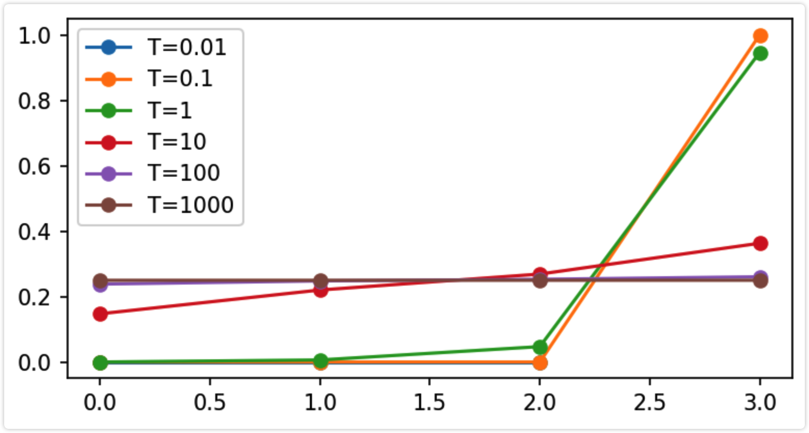
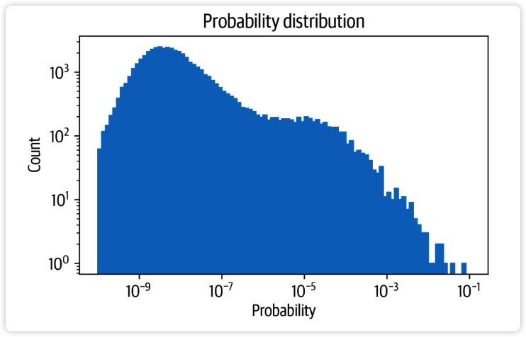
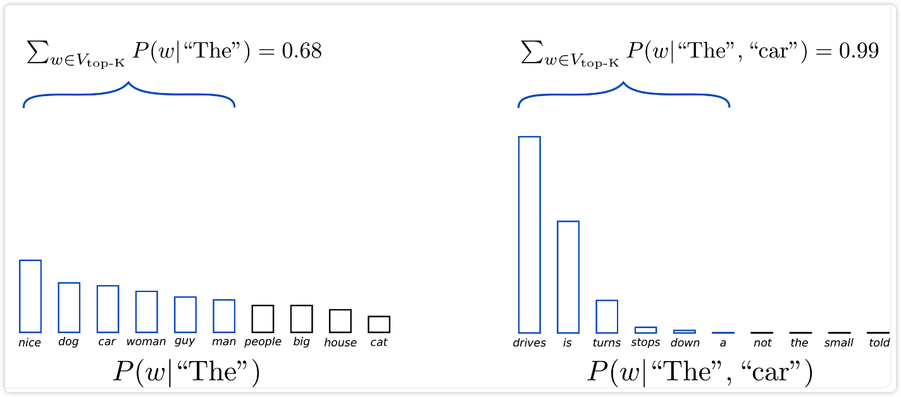

<a name="YvKLJ"></a>

# GPT2技术报告

智能2111 智能问答小组

<a name="reCyL"></a>

## GPT2 overall


GPT3开源了吗?<br />没有 2023.06

为什么不先讲GPT1?<br />太过简单

GPT的全称是什么?<br />Generative Pre-training Transformer

GPT最核心的能力是什么?<br />text generation

为什么说 text generation 是GPT最核心的能力?<br />文本生成是实现以下技术的基础:<br />机器翻译<br />问答系统<br />对话生成<br />文本摘要<br />代码生成<br />文本修复

GPT2 是如何预训练模型的?<br />在英文语料上基于前1个词预测第2个词, 再基于前2个词预测第3个词...<br />进行无监督训练, 也被成为因果(自回归)语言建模(CLM), 最终得到因果语言模型(CLM)

- (autoregressive or causal) language modeling
- (autoregressive or causal) language models

整个训练过程其实就是在不断求解多分类问题<br />参考<br />Language Models are Unsupervised Multitask Learners <br />https://d4mucfpksywv.cloudfront.net/better-language-models/language_models_are_unsupervised_multitask_learners.pdf<br />openai GPT2 blog<br />https://openai.com/research/better-language-models

预训练的数据是如何得到的?<br />从网络抓取了包含了维基百科、书籍、新闻、博客、帖子、代码等各种人类语言资料得到的40GB学习材料, 称为 WebText 数据集, 但尚未完全开源. <br />开源部分

- 前1000域名的名称: https://github.com/openai/gpt-2/blob/master/domains.txt
- openai开源一部分训练gpt2的数据: https://github.com/openai/gpt-2-output-dataset


为什么要进行pre-training?<br />pre-training后的模型可以被prompt(context)激活广泛的能力 eg. 算术, 纠错, 翻译<br />

GPT2的解码策略(decodeing strategies)是什么?<br />converting the model’s probabilistic output to text

- converting the model’s: LMHead层
- probabilistic output: vocab size classification
- text: token

解码的过程是iterativel，也就意味着更多的计算量<br />解码中需要关注 quality & diversity<br />decodeing strategies 需要考虑以下两项

- greedy & beam search decoding
- top-k & nucleus sampling


为什么需要关注diversity? 一个高频词在一个句子中重复太多, 会使句子变得无意义

GPT2的具体解码过程是怎么样的?<br />自回归解码<br />自回归可以看错是求一系列条件概率的乘积

- chain rule of probability to factorize it as a product of conditional probabilities

$$\begin{split} \textbf{x}=x_1,x_2,\cdots,x_k. \textbf{y}=y_1,y_2,\cdots,y_t. \end{split}$$<br />$$\begin{split} P(\textbf{y}|\textbf{x})&=P(y_1,y_2,\cdots,y_t|\textbf{x})\\ &=\Pi_{t=1}^Np(y_t|y_{\lt t}, \textbf{x})\quad (y_{\lt t}=y_{1,2,\cdots,t-1}) \end{split} $$$$\begin{split} &p(y_t=w_i|y_{\lt t}, x)=\text{softmax}(z_{t,i})\\ &\hat{\textbf{y}}={\arg\max}_{\textbf{y}}P(\textbf{y}|\textbf{x}) \end{split}$$<br />自回归单向的, 且从左到右 (BERT 的 B 表示的含义就是 bidirectional）

hunggingface中提供哪些GPT2的版本,其中64*12的含义是什么?<br /><br />头的维度是64<br />一共有12个头<br />参考<br />https://huggingface.co/gpt2

如何调用其中的gpt2-xl, 并查看其模型规模

```
import torch
from torch import nn
import torch.nn.functional as F
import transformers
from transformers import AutoTokenizer, AutoConfig, AutoModel
import numpy as np
import pandas as pd
import matplotlib.pyplot as plt
import matplotlib as mpl
from IPython.display import Image
# default: 100
mpl.rcParams['figure.dpi'] = 150
device = 'cuda' if torch.cuda.is_available() else 'cpu'
device
```


get_params(model)的结果是1,557,611,200代表的含义是什么?<br />第二层有557个权重和偏置<br />参考<br />https://huggingface.co/gpt2-xl

下面是config输出的参数, 其中64*25在哪?<br /> "n_head": 25,

下面是mode的输出的参数, 其中的block=48在哪?<br />48 x GPT2Block

模型是如何做大的?<br />通过增加 hidden dim 和 block 的数量

<a name="TmJKd"></a>

## GPT2 toekenizer 


toekenizer 是什么?<br />分词器<br />将句子分成一个个token

GPT2 的 toekenizer 是什么?<br />BEP<br />eg.<br />{“older”: 3, “finest”: 9, “lowest”: 4}<br />将每个单词拆分为单个字符，进行第一次统计：<br />{:10, o: 7, l:7 d:3, e:16, r:3, f:9, i:9, n:9, s:13, t:13}， 频次最高的的e,16次<br />BPE 算法的下一步是寻找最频繁的字符对，进行合并，发现 es 一起出现13次， 则es合并， s消失，e还剩3次，更新后如下：<br />{:10, o: 7, l:7 d:3, e:3, r:3, f:9, i:9, n:9, es:13, t:13}， 频次最高的的es 13次, t 13次。<br />下一步以此种方法继续进行更新， 发现est可以进一步合并。<br />{:10, o: 7, l:7 d:3, e:3, r:3, f:9, i:9, n:9, est:13}<br />下一步以此种方法继续进行更新，一步步进行合并更新。算法的停止标准继续迭代直到达到预设的subword词表大小或下一个最高频的字节对出现频率为1。<br />Byte Pair Encoding: 在减少token数量和保留token含义之间寻找一个平衡点<br />参考<br />https://zhuanlan.zhihu.com/p/620508648

下面是toekenizer的输出的参数, 其中模型的vocab_size是多少, 输入序列的长度是多少?<br />50257(bert 30522)<br />1024

模型训练中的began_of_sentence, end_of_sentence, Unknown如何查看, 是什么?<br /><|endoftext|>

通过下面的演示你发现经过toekenizer后的token有哪些特点?<br />大小写是不同的token<br />空格也是token<br />空格单词和单词是两个不同的token<br />token与单词的长度无关

- 很长的word可能只对应一个token
- 不是很长的一个word可能对应多个token


猜测下面句子中的"chartreuse"这个词分成token的结果是多少?<br />[8262, 260, 1904]

gpt是如何进行attention_mask的?<br />

为什么要进行attention_mask?<br />更好地构造结构化，批次化输入 (tensor, shape 是一定的)

<a name="lSAXQ"></a>

## GPT2 mode forward


下面加载的model和model_clm有什么区别?<br />model<br />model_clm<br />将GPT2Model起一个变量叫transformer<br />在最后加了一个lm_head的线性层

最后填加了一个lm_head的线性层是什么? mlp: hidden_state => vocab_size

为什么要起一个变量叫transformer?

对比model.transformer()的前向计算过程和自定义(model.transformer()) 的前向过程是否相同?<br />简化版的前向过程

自定义gpt2_transformer_forward是怎么来的?<br />参照源码<br />源码位置如下位置:<br />

对比 Imhead_model(input_ids) 和 自定义的Imhead_model forward 是否相同

GPT输入输出的维度是多少?<br />1600到50257的一个MLP

<a name="JG5V6"></a>

## GPT2 greedy search


为了达到解码结果的质量和多样性的平衡, 有哪两种解码策略?<br />greedy search decoding : 搜狗输入法, 每次都用top1的侯选<br />beam search decoding

decoding/generating 的场景有哪些?<br /> - 文本生成<br /> - seq2seq（机器翻译等）<br /> - image caption：image2text

自回归的过程为什么要变成加法?<br />$$ \begin{split} P(\textbf{y}|\textbf{x})&=P(y_1,y_2,\cdots,y_t|\textbf{x})\\ &=\Pi_{t=1}^Np(y_t|y_{\lt t}, \textbf{x})\quad (y_{\lt t}=y_{1,2,\cdots,t-1}) \end{split} $$<br />$$\begin{split} \log P(\textbf{y}|\textbf{x})&=\log P(y_1,y_2,\cdots,y_t|\textbf{x})\\ &=\log\Pi_{t=1}^Np(y_t|y_{\lt t}, \textbf{x})\quad (y_{\lt t}=y_{1,2,\cdots,t-1})\\ &=\sum_{i=1}^N\log p(y_{t}|y_{\lt t}, \textbf x) \end{split}$$<br />避免浮点数的下溢<br />计算涉及到非常接近零或接近机器可表示的最小非零值的数值时，由于数值太小，计算机无法精确表示它们，也就变成了0

查看下列 greedy search decoding的使用<br /><br />

huggingface中的transformer库提供给我们的库方法是什么?

使用下面openai官方的案例, 对比我们自己写的greedy_search和model.generate的结果

greedy search decoding 的缺点是什么?<br />没有多样性(diversity 不足), 每次都是最大化的输出, 整体整体未必是最优<br />重复性较高

什么时候会用到 greedy search ?<br />数学运算追求的是精确，而不是多样性

<a name="ndddc"></a>

## GPT2 beem search


什么是beem search?<br />束搜索<br />当模型已经训练完成, 即发生在测试阶段

什么是 beem search decoding ?<br />$$\hat y_t = {\arg\max}_{y_t}P(y_t|y_{\lt t}, \textbf{x})\quad (y_{\lt t}=y_{1,2,\cdots,t-1})$$<br /><br />宽度树: 2 每次展开2个

如何设置 beem search?<br />$$\begin{split} \log P(\textbf{y}|\textbf{x})&=\log P(y_1,y_2,\cdots,y_t|\textbf{x})\\ &=\log\Pi_{t=1}^Np(y_t|y_{\lt t}, \textbf{x})\quad (y_{\lt t}=y_{1,2,\cdots,t-1})\\ &=\sum_{i=1}^N\log p(y_{t}|y_{\lt t}, \textbf x) \end{split}$$

为什么要取log?

对比自己实现的 beem search 和 API 中实现的beem search?

设置不允许出现重复数字两次, 并观察logp的变化<br />logp会变低, 但是句子的多样性变高了, 重复的变少了

<a name="zGCxm"></a>

## GPT2 sampling


什么是 sampling?<br />logits经过softmax后得到概率分布, 在从概率分布中进行采样, 即确定yt应该generate成哪个token<br />$$P(y_t=w_i|y_{\lt t}, \textbf{x})=\text{softmax}(z_{t,i})=\frac{\exp(z_{t,i})}{\sum_{j=1}^{|V|}\exp(z_{t,j})}$$

- $$w_i\in V$$，整个 vocabulary， 50257
- 对概率化的输出进行sample，就出现了随机性；（do_sample=True）
  - greedy search 是没有随机性的，是确定性的；

基于概率分布进行采样就会出现随机性, 0.01的概率依然有概率被采样到<br />

如何使采样的结果更加多样化?<br />使分布更平滑

如何使分布更平滑?<br />softmax with temperature

为什么需要softmax with temperature?<br /><br />当T越小, 分布越尖锐(大概率会集中在logitc大的值上)<br />当T越大, 分布越平滑<br />参考:<br />https://stackoverflow.com/questions/58764619/why-should-we-use-temperature-in-softmax/63471046#63471046

什么是 softmax with temperature ?<br />$$P(y_t=w_i|y_{\lt t}, \textbf{x})=\text{softmax}(z_{t,i})=\frac{\exp(z_{t,i}/T)}{\sum_{j=1}^{|V|}\exp(z_{t,j}/T)}$$

- 温度越高，分布越平滑

参考:<br />Distilling the Knowledge in a Neural Network https://arxiv.org/pdf/1503.02531.pdf

- Using a higher value for T produces a softer probability distribution over classes 


huggingface中如何实现 softmax with temperature ?

- do_sample=True：
- 温度越高，gibberish（乱语），raw token 依然会被采样到；
- 温度越低，coherent（连贯有条理）
  - less weird 
  - temperature →0, temperature scaled sampling becomes equal to greedy decoding
- coherence（low temperature） & diversity（high temperature）：trade off


观察下面 temperature 分别等于 0.5, 1., 2. 的情况?<br />结论<br />温度越高, 越混乱, 越容易出现一些不常见的token<br />温度越低, 越连贯, 但多样性会少

其他平衡连贯性&多样性( coherent & diversity )的方法有哪些?<br />限制采样的范围（tokens）: 在 coherent 中寻求 diversity

- top_k: 
- top_p(nucleus sampling)

参考：<br />https://huggingface.co/blog/how-to-generate<br />truncate the distribution of the vocabulary. 

什么是top_k?<br />当 k == 2000, 只对概率top2000的进行选择, 避免低概率地选择<br />当 top_k == 0 时，deactivate top_k，不对候选 tokens 的数量进行限制

假设只取top200会有什么问题?<br />top2000只覆盖了50%的累计概率分布, 后40000的token其实还有很多高概率的token

什么是top_p?<br />选取概率分布中90%以上的token

hunggingface中如何使用top_k和top_p?

查看top_k和top_p在词表上的概率分布<br /><br />图1: 概率密度函数 x轴: 对应的概率 y轴: 对应概率的数量 <br />图2: 累计概率分布 x轴: top_k对应的k=2000, k=2000对应了约98%的概率分布; 核词阿阳选择0.95, 对应约1000个token<br />top_k和top_p依然只是选取了很少的数

top_k和top_p的区别是什么?<br />top_k是刚性的<br />核采样和动态的

为什么说top_p是动态的?<br />当概率分布越均匀, top_p对应的token会越多<br />如果是偏态分布, 都集中在一些高概率的次上, token就越少<br />top_p所取的token数量取决于概率分布<br />

GPT2使用了哪种采样方法<br /><br />https://openai.com/research/better-language-models

总结<br />有了概率分布, 我们才能采样, 对概率分布进行采样就会出现随机性<br />在计算概率分布的时候, 我们可以加上温度系数, 让它变得更平滑和集中, 温度越高, 分布越平滑; 温度越低, 连贯性越好, 多样性不好; 其实是一个连贯性和多样性的平衡(trade off)<br />得到概率分布后, 不管你有没有经过温度系数进行调控, 都有两种采样的策略来实现连贯性和多样性的平衡, top_k和top_p都是限制采样的范围, top_k是只在top_k的范围内进行选择token, 而top_p是考虑了累计概率分布来选择token<br />参考<br />https://huggingface.co/blog/how-to-generate

<a name="cYR1G"></a>

## **GPT2 example**


中文预训练好的GPT模型有哪些?<br />https://github.com/Morizeyao/GPT2-Chinese<br />https://github.com/Hansen06/GPT2-Chinese

<a name="J93lu"></a>

## **GPT3 openaiapi**


既然无法对大语言模型的参数进行修改, 又无法自己训练GPT, 如何更好的使用openai 提供的 API?<br />AICG(Artificial Intelligence for Computer Graphics，计算机图形学的人工智能技术)

如何申请openai的api<br />https://platform.openai.com/account/api-keys<br />

openai的api有什么用?<br />https://openai.com/pricing<br />语言模型<br /><br /><br /><br />微调模型<br /><br />图片模型<br /><br />ada：350M params， fast<br />babbge：1.3B<br />curie：6.7B<br />davinci：175B，most powerful；

如何使用openai api通过promote进行文本生成(补全)?<br />Say this is a test

This is indeed a test.

设置token=256

如何通过api生成图片?<br />对比: https://github.com/Compvis/stable-diffusion<br />

如何使用api的chatgpt3.5实现多轮对话?

<a name="d8tf7"></a>

## GPT3

<br />

<a name="KpDaJ"></a>

## openai


让我们回到谷歌AlphaGo击败李世石的2016年, 那年openai才发布了OpenAI Gym 和 Universe稍有名气, 2017年又好不容易在Deta2游戏上战胜了人类顶级选手, 结果那边谷歌发布了Transformer模型, 可以说这个模型奠定所有大语言模型的基础架构. 也是我们小组重点研究的GPT模型中的T, 然后在2018年OpenAI基于Transformer发布了GPT第一代, 结果谷歌随后重磅发布了跨时代意义的Bert, 比GPT参数大四倍, 几乎所有的表现上都碾压GPT. 转折是2019年.<br />[GPT1-2018.06](https://cdn.openai.com/research-covers/language-unsupervised/language_understanding_paper.pdf)<br />7月, 微软CEONadella投资OpenAI10亿美元 openai发布

[GPT2-2019.02](https://d4mucfpksywv.cloudfront.net/better-language-models/language_models_are_unsupervised_multitask_learners.pdf)<br />[GPT3-2020.05](https://papers.nips.cc/paper_files/paper/2020/file/1457c0d6bfcb4967418bfb8ac142f64a-Paper.pdf)

GPT3引起业内轰动, 紧接着就是我们都知道的故事, 基于GPT3.5的ChatGPT在2022年底发布后一鸣惊人<br />openai在这4年时间发生了什么, GPT模型又在这4年又发生了什么改变, 使其实现了对谷歌AI研究的追赶.<br />答案就写在每代GPT发布的论文中, 我们会用通俗易懂的语言给大家讲解GPT版本的改变.<br />

目前我们小组正处于对GPT工作原理的研究中?<br /><br />GPT中的G代表生成(Generative), P代表的是预训练, T代表"Transformer"一种模型结构<br />生成代表GPT是用于解决NLP领域的语言生成任务<br />那预训练又代表什么呢?

我们可以把预训练的过程用"开卷有益"来描述, 而把chatgpt当成一只不会说话鹦鹉<br />“开卷有益”就好比，在鹦鹉旁边放一台电视机，把各种新闻、国产剧、国外剧、广告、综艺等内容都播给它听。让它自己学，不用人看着。<br /><br />那给它“开卷”多少才够呢？<br />关于这一点，不妨回顾一下历史。我们刚才提过的openai做过的几代GPT模型，我们且不看其他的改进，仅比对一下规模。

<br />GPT-1 的学习材料约 5GB。这里 1 MB 能存 30-50 万汉字，而 1 GB 是 1024 MB。

<br />GPT-1 的参数是 1.17 亿。参数反映着模型大小，参数越多，模型能建构的规律就越复杂，能记忆的信息和学习的知识也就越多，相当于是大脑中神经突触的数量。高中的直线斜截式方程就 2 个参数，而它有 1 亿多个。

<br />不过 GPT-1 在一些任务的表现上，不如BERT。<br />BERT 也是一种生成语言模型，不同点于，GPT 的学习方式是单字接龙（只允许用上文预测下一个词），而 BERT 的学习方式是完形填空（允许用上下文预测空缺的词）。

<br />到了 2019 年 2 月，OpenAI 又训练了 GPT-2：<br />学习材料约 40GB，是第一代的 8 倍。<br />最大模型的参数为 15 亿，是第一代的 13 倍。<br />效果有很大提升，但反响并不轰动。

<br />可在 2020 年 5 月，GPT-3 出来了：<br />最大模型参数到了 1750 亿，是第二代的 116 倍。<br />所使用的学习数据更是达到了 45 TB，是第二代的 1125 倍，其中包含了维基百科、书籍、新闻、博客、帖子、代码等各种人类语言资料。

<br />已经和前两代不是一个量级的了，也被称为「超大语言模型（LLM）」。

<br />到了此种规模的 GPT-3 就轻松学会了各种词语搭配和语法规则，能明白同一个意思的不同表达，还学会了编程语言，以及不同语言之间的关系，可以给出高质量的外语翻译，还能把我们的口语转换成代码。

<br />然而 开卷有益 却存在一个问题：尽管GPT拥有了海量的知识，但回答形式和内容却不受约束。因为它知道的太多了，见到了一个人几辈子都读不完的资料，会随意联想，它有能力回答我们的问题，但我们却很难指挥它回答出来。<br />它就像一只脑容量超级大的鹦鹉，已经听过了海量的电视节目，会不受控制地乱说.<br />丑闻、脏话等全都有可能蹦出，难以跟人类合理对话。可如果难以指挥它，那它对我们也没有什么用。要怎么解决这个问题呢？

<br />其实解决思路与「我们教鹦鹉对话」的思路是一样的。<br />例如，当有人问“如何撬锁”时，不能让它真的回答撬锁方法，而要让它回答“撬锁是违法行为”。那就要把「“如何撬锁 撬锁是违法行为”」作为「学习材料」让它进行学习. 我们称这个过程为模板规范。<br />大家可能会好奇，为什么不在一开始就直接教它最正确的对话方式和对话内容呢？

<br />一方面，「优质对话范例」数量有限，所能提供的语言多样性不足，可能难以让模型学到广泛适用的语言规律，也无法涉猎各个领域。另一方面， 优质对话范例 都需要人工专门标注，价格不菲。这一点其实和「为什么不直接教鹦鹉对话，而是让它先听电视节目」类似。<br />或许未来，有了足够多的「优质对话范例」后，就会跳过“开卷有益”这一步。

经过“开卷有益”和“模版规范”这两个训练阶段后，模型已经变得极其强大了。但“模板规范”的训练阶段也存在不足，那就是：可能导致 ChatGPT 的回答过于模板化，限制其创造力。

<br />如谚语所说“文无第一，理无第二”，科学领域的问题有标准答案，可以用“模版规范”的训练方式来满足需求。

<br />但人文领域的问题没有标准答案，持续使用“模版规范”可能会让 ChatGPT 成为“高分范文的模板复刻机”，无法满足人们的需求。正如观众会用“好莱坞流水线”批评电影的模版化，阅卷老师会给跳出模版的好文打高分一样，

<br />我们也希望能让 ChatGPT 提供一些超越模板、但仍符合人类对话模式和价值取向的创新性回答。

<br />那么，如何在维持人类对话模式和价值取向的前提下，提高 ChatGPT 的创新性呢？

<br />可以联想一下鹦鹉是怎么被训练的。当我们教会鹦鹉一些基本对话后，就可以让鹦鹉自由发挥，有时鹦鹉会蹦出一些非常有意思的对话，这时我们就可以给它吃的，强化它在该方向的行为。<br />在训练 ChatGPT 的第三阶段，也是类似的过程。

<br />这一次，不再要求它按照我们提供的对话范例来学习，而是直接向它提问，再让它自由回答。如果回答得妙，就给予奖励，如果回答不佳，就降低奖励。然后利用这些 人类评分 去调整 ChatGPT 的模型。<br />在这种训练中，我们既不会用现有的模板来限制它的表现，又可以引导它创造出符合人类认可的回答。我们把这一阶段称为“创意引导”。

<br />ChatGPT 正是在 GPT-3.5 数据规模的基础上，先后经历了“开卷有益”、“模板规范”和“创意引导”，三个阶段的训练后，得到的「生成语言模型」。

<br />这三个阶段的专业称呼分别为“无监督学习”、“有监督学习”和“强化学习”，可以说，ChatGPT 把机器学习中的几大训练模式都用到了。

我们再来看GPT的3篇论文标题, 我们就知道openai这4年都在探索什么了?<br /><br />

GPT2和GPT1的区别?<br />

<a name="VVTLK"></a>

## InstructGPT

<br /><br />

<a name="vDKlj"></a>

## personal chatgpt


有哪些开源的大语言模型?<br />llama => alpaca => vicuna<br />llama: pretrained model, 作用类似于 text-davini-003（gpt3）

- https://github.com/facebookresearch/llama

self instruct (fine tune)<br />alpaca：https://github.com/tatsu-lab/stanford_alpaca

- prompt, answer：from chatgpt

vicuna：https://github.com/lm-sys/FastChat<br />from shareGPT

- long conversation/context window

llama 开源了又没完全开源

- 开源的是代码
- weights 没有完全开源，不可以商用；
- vicuna weights：https://github.com/lm-sys/FastChat
- https://lmsys.org/blog/2023-03-30-vicuna/


llama是什么?<br />LoRA: **Lo**w-**R**ank **A**daption of large language models

- A random projection to a smaller subspace
  - parameter efficient
  - PEFT
  - https://arxiv.org/abs/2106.09685

实现细节上

- 是一个 adaptor of pretrained model
- adaptor 是小的
  - pretrained model 是大的

 - large language models<br /> - large vision models

- **freezes** pre-trained model weights
- **injects** trainable rank decomposition matrices
  - into each layer of transformer Architecture


