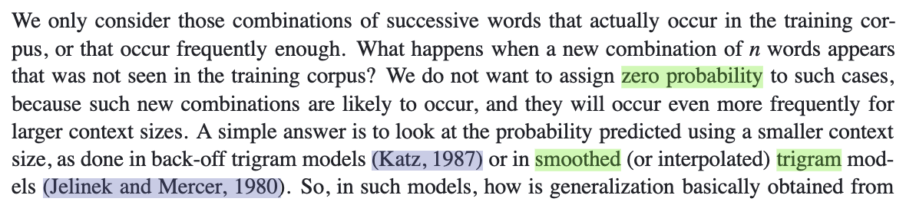
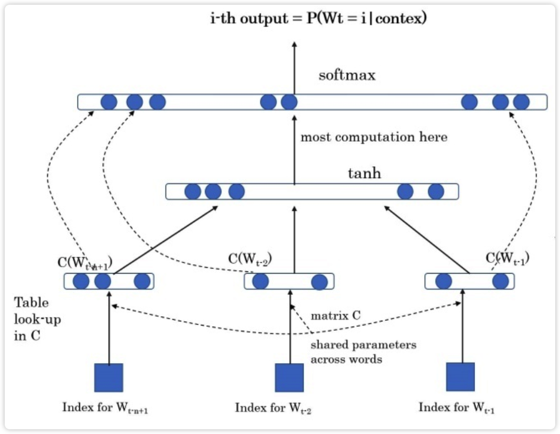
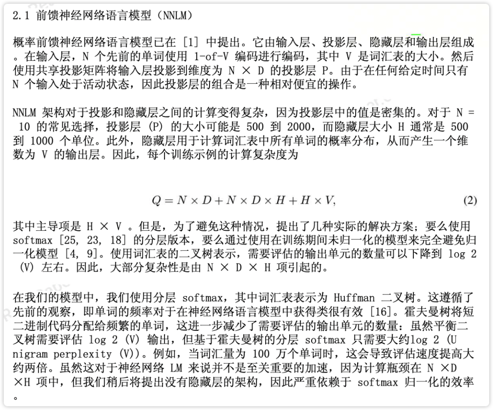
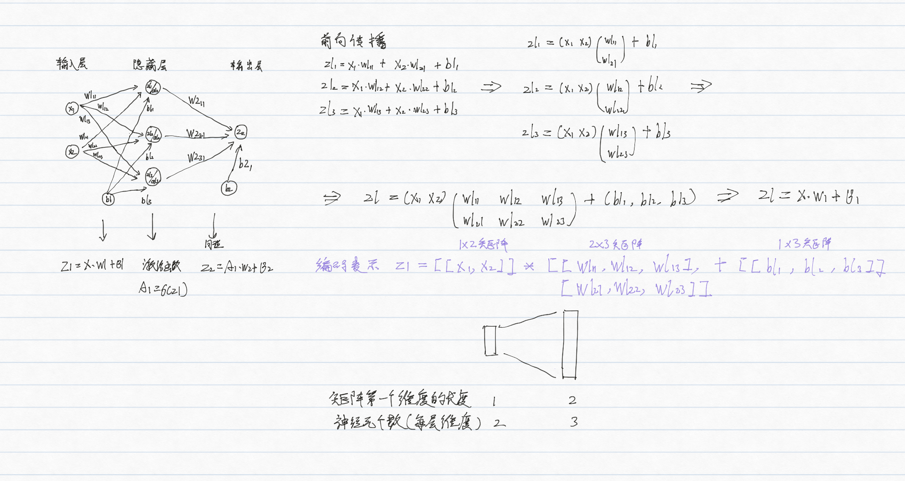
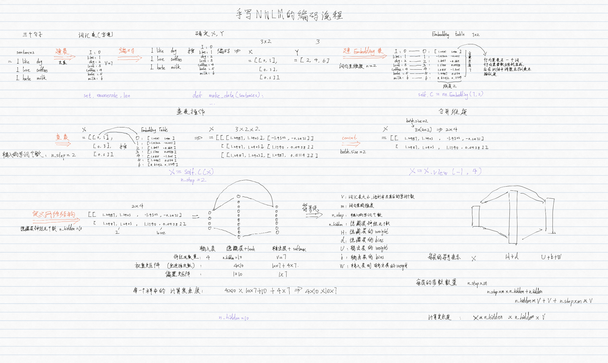
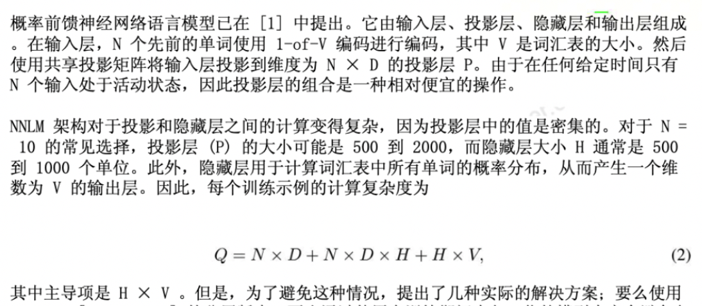
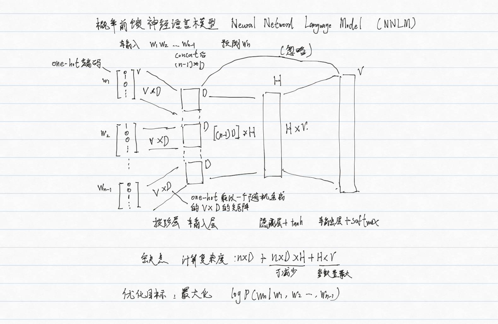
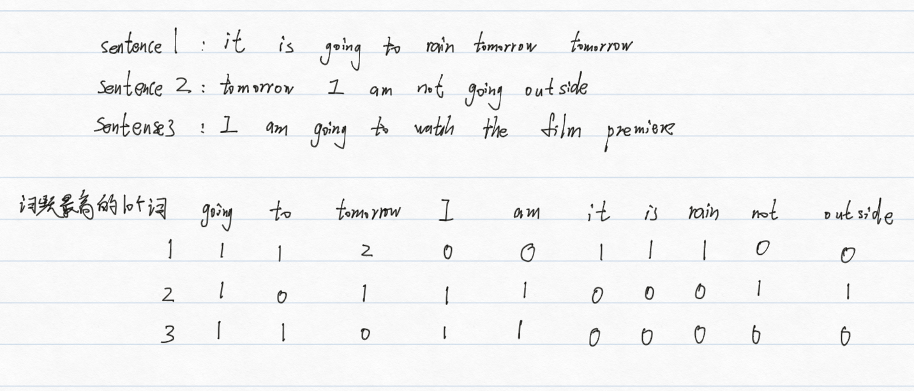
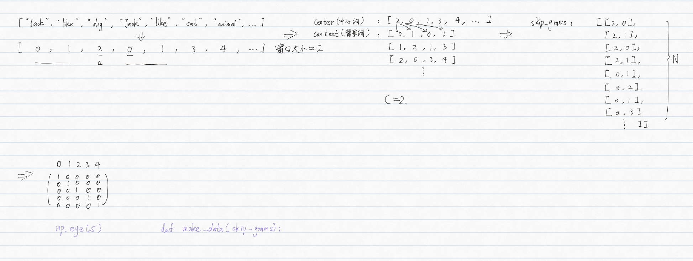
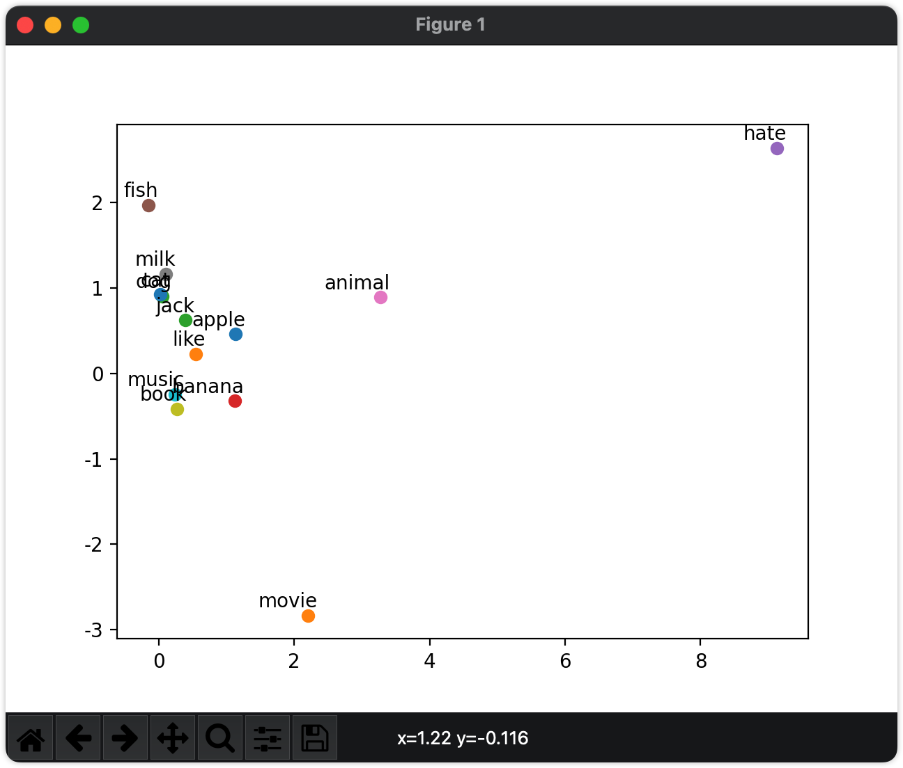

<a name="DEPcd"></a>

## 统计语言模型


什么是语言模型?<br />用于解决两个语言任务的模型<br />预测一句话: “判断这个词的磁性” 和 “判断这个词的词性” 哪个句子出现的概率更大<br />预测一个词: "判断这个词的__" 接下来出现字典中哪个词的概率更大<br />共性: 都是分类任务

解决上述两个问题的语言任务的模型有哪些?<br />统计语言模型<br />神经网络语言模型

如何计算下面4句话中"的"后面为"词性"和"磁性"的哪个概率更大?<br />单词的词性<br />词性是名词<br />磁铁很强的磁性<br />电池的词性是名词<br />$$ P(词性|的) = \frac{count(词性, 的)}{count( 的)}  = \frac{2}{3}$$<br />$$P(磁性|的) = \frac{count(磁性, 的)}{count( 的)}  = \frac{1}{3}$$<br />"的"后面为"词性"的概率更大

统计语言模型是如何解决第一个问题的?<br />条件概率的链式法则<br />eg.<br />有一个包含 n 个句子的语料库, <br />“判断这个词的磁性” 和 “判断这个词的词性” 哪个句子出现的概率更大?<br />$$P(这个|判断) = \frac{count(判断, 这个)}{count( 判断)} $$<br />$$P(w_1, w_2, ..., w_n) = \prod_{i=1}^{n} P{(wi|w1, w2, ..., w_{i-1})}$$<br />选择联合概率更大的那个句子

统计语言模型是如何解决第二个问题的?<br />条件概率<br />eg.<br />有一个包含 n 个句子 和 m个单词的字典, <br />"判断这个词的__" 接下来出现字典中哪个词的概率更大<br />$$P(w_{next}|w_1, w_2, ..., w_n) = \frac{count(w_{next}, 判断, 这, 词, 的)}{count(判断, 这个, 词, 的)} , 其中Wnext为遍历字典中的每一个词$$<br />选择条件概率最大的那个词

统计语言模型存在问题和解决方法?<br />问题: <br />字典长度非常大,当统计到词性这个词时<br />P(词性| “判断”，“这个”，“词”，“的”，……) => 时间和成本太高<br />解决:<br />n 元语言模型(n_gram模型): 有m个词, 只取n个词

"计算下面4句话中"的"后面为"词性"或"磁性"的概率"这个任务用的是几元语言模型<br />2元<br />"的"后面: 2个词, 二元语言模型<br />"词的"后面: 3个词, 三元语言模型(trigram)

如果所求的词是词库中没有的词, 出现零概率问题(0/0)的情况怎么办?<br />平滑策略<br />eg.<br />$$ P(w_{i}|w_{i-1}) = \frac{count(w_{i-1})+1}{count(w_{i-1})+|v|} $$<br />复杂的平滑策略: Laplace smoothing(拉普拉斯平滑), Lidstone...<br /><br />图1: [A Neural Probabilistic Language Model(2003)](http://www.jmlr.org/papers/volume3/bengio03a/bengio03a.pdf) 原文

<a name="ksbSV"></a>

## 神经网络语言模型


第一个解决了上述两个问题的神经网络语言模型是什么?<br />NNLM<br />神经网络模型: Neural Netword Language Model<br /><br />图1: [A Neural Probabilistic Language Model(2003)](http://www.jmlr.org/papers/volume3/bengio03a/bengio03a.pdf) 原图<br />图2: [Efficient Estimation of Word Representations in Vector Space(2013)](https://readpaper.com/paper/1614298861) 原文

NNLM是如何解决上述第两个问题的?<br />第一步: 将n-1个单词的索引转换为词向量<br />第二步: concat<br />X = [ x1, x2, x3, x4,... ,xn ]<br />第三步: 双层神经网络 + 残差网络<br />$$V$$=[ "判断", "这个", "词", "的", "词性" ]<br />第一层: tanh(H*X+d)<br />第二层: softmax ([tanh(H*X+d)]U + d+ WX) == [0.1, 0.2, 0.1, 0.3, 0.4] $$\in[1, V_L]$$

回顾一个双层神经网络的训练流程?<br />

根据上面步骤手写NNLM的编码流程, 用以下面3句子作为训练数据, 输入i like, 输出dog. <br />sentences = ["i like dog", "i love coffee", "i hate milk"]<br />

通过pytorch构建一个NNLM, 用以下面3句子作为训练数据, 输入i like, 输出dog. <br />尝试输入like love查看输出结果<br />sentences = ["i like dog", "i love coffee", "i hate milk"]

```
# code by jarrycf @niit

'''
输出:
[[0, 6], [0, 3], [0, 1]]
1000 0.014071048237383366
1000 0.006654839031398296
['dog', 'coffee', 'milk']
['coffee']
'''

import torch
import torch.nn as nn
import torch.optim as optimizer
import torch.utils.data as Data

dtype = torch.FloatTensor

# 1. 构建词汇表
sentences = ["i like dog", "i love coffee", "i hate milk"]
# ['i', 'like', 'dog', 'i', 'love', 'coffee',...]
sentences_list = " ".join(sentences).split()
vocab = list(set(sentences_list))
word2idx = {w: i for i, w in enumerate(vocab)}
'''
{
'i': 0
'like': 1
'dog': 2
'love': 3
'coffee': 4
'hate': 5
'milk': 6
}
'''
idx2word = {i: w for i, w in enumerate(vocab)}

V = len(vocab)

# 2. 确定X, Y

def make_data(sentences):
    input_data = []
    target_data = []
    # sentences = ["i like dog", "i love coffee", "i hate milk"]
    for sen in sentences:
        sen = sen.split()  # ['i', 'like', 'dog']
        input_tmp = [word2idx[w] for w in sen[:-1]]  # [[0, 1]]
        target_tmp = word2idx[sen[-1]]  # [2]

        input_data.append(input_tmp)
        target_data.append(target_tmp)
    return input_data, target_data

input_data, target_data = make_data(sentences)
print(input_data)
input_data, target_data = torch.LongTensor(
    input_data), torch.LongTensor(target_data)

# 3. dataset
dataset = Data.TensorDataset(input_data, target_data)

# 4. dataload
loader = Data.DataLoader(dataset, 2, True)

# 5. 定义网络结构
# parameter
m = 2
n_step = 2
n_hidden = 10

class NNLM(nn.Module):

    def __init__(self):
        '''
        V：词汇表的大小，即语料库中去重后的单词个数
        m：词向量的维度，一般大于50
        H：隐藏层的weight
        d：隐藏层的bias
        U：输出层的weight
        b：输出层的bias
        W：输入层到输出层的weight
        h：隐藏层神经元个数
        '''
        super(NNLM, self).__init__()
        self.C = nn.Embedding(V, m)
        # nn.Paramete默认参数requires_grad=True, 在方向传播中自动计算梯度
        self.H = nn.Parameter(torch.randn(n_step * m, n_hidden).type(dtype))
        self.d = nn.Parameter(torch.randn(n_hidden).type(dtype))
        self.b = nn.Parameter(torch.randn(V).type(dtype))
        self.W = nn.Parameter(torch.randn(n_step * m, V).type(dtype))
        self.U = nn.Parameter(torch.randn(n_hidden, V).type(dtype))

    def forward(self, X):
        '''
        X : [barch_size, n_step]
        '''
        X = self.C(X)  # [batch_size, n_step, m]
        X = X.view(-1, n_step * m)  # [batch_size, n_step * m]
        # 隐藏层: tanh(XH+d)
        hidden_out = torch.tanh(torch.mm(X, self.H) + self.d)
        # 输出层: softmax (hidden * U + d + XW)
        output = torch.mm(hidden_out, self.U) + self.b + torch.mm(X, self.W)
        return output

model = NNLM()
optim = optimizer.Adam(model.parameters(), lr=1e-3)
criterion = nn.CrossEntropyLoss()

# 6. 模型训练
for epoch in range(1000):
    for batch_x, batch_y in loader:
        pred = model(batch_x)
        loss = criterion(pred, batch_y)

        if (epoch + 1) % 1000 == 0:
            print(epoch + 1, loss.item())
        optim.zero_grad()
        loss.backward()
        optim.step()  # 根据当前的参数梯度信息，更新模型中的参数

# 7. 模型预测
pred = model(input_data).max(1, keepdim=True)[1]
print([idx2word[idx.item()] for idx in pred.squeeze()])

'''
预测结果过程
=> model(input_data)
tensor([[-5.2228, -0.6685, -1.4815, -3.3014, -0.9889,  4.8275, -1.3545],
        [-3.3357,  5.4271, -2.5973, -2.6110,  0.9228, -1.4809, -1.7979],
        [-8.5480, -1.6075, -3.1393, -4.1746,  3.1858, -3.8107, -2.6344]],
=> .max(1)
(values = tensor([5.7182, 5.4525, 4.1372], indices=tensor([2, 1, 4]))
=> keepdim = True
(values = tensor([[5.7182], [5.4525], [4.1372]], indices=tensor([2], [1], [4]]))
=> [1] 
tensor([2], [1], [4]])
=> .squeeze()
tensor([2, 1, 4]) 
=> for idx in tensor([2, 1, 4]) 
<generator object <genexpr> at 0x10afc9b60> # tensor(2) 
=> .item(tensor(2))
2
=> idx2word[2]
['dog']
'''

# 尝试输入like love查看输出结果
input_data = ["like", "love"]
input_data = [word2idx[w] for w in input_data]  # [[0, 1]]
input_data = torch.LongTensor(input_data)

pred = model(input_data).max(1, keepdim=True)[1]
print([idx2word[idx.item()] for idx in pred])
```


通过 pytorch 实现的 NNLM 和原论文中的 NNLM 有哪些异同点?<br />不同点:

1. 训练数据的构造方式不同：原论文中的 NNLM 是基于 n-gram 模型构造的训练数据，而这段代码中的 NNLM 是基于句子构造的训练数据。
2. 输入层的构造方式不同：原论文中的 NNLM 使用的是词袋模型（bag-of-words）对输入层进行编码，而这段代码中的 NNLM 使用的是词嵌入（word embedding）对输入层进行编码 原论文采用的是传统的基于矩阵乘法的词嵌入方法, 也被称为全连接层方法. 在这个方法中每个单词都被表示为一个 one-hot 向量，随机初始化一个权重矩阵，将 one-hot 向量乘以权重矩阵得到单词的词向量表示 我们采用的是PyTorch 中的 nn.Embedding 使用的是基于查表的词嵌入方法，也被称为嵌入层方法. 在这个方法中，每个单词都被映射为一个固定维度的向量，这个向量可以通过训练神经网络来得到，也可以使用预训练好的词向量
3. 隐藏层的激活函数不同：原论文中的 NNLM 使用的是 sigmoid 函数作为隐藏层的激活函数，而这段代码中的 NNLM 使用的是双曲正切函数（tanh）作为隐藏层的激活函数
4. 输出层的构造方式不同：原论文中的 NNLM 使用的是基于类别的 softmax 函数对输出层进行预测，而这段代码中的 NNLM 使用的是基于词的 softmax 函数对输出层进行预测。
5. 损失函数有点不同

原论文的交叉熵还加上了正则<br />$$ \text{CE}(\mathbf{y}, \hat{\mathbf{y}}) = -\sum_{i=1}^{V} y_i \log(\hat{y}_i) $$<br /><br />PyTorch 中的交叉熵<br />$$ \text{CE}(\mathbf{y}, \hat{\mathbf{y}}) = -\log \left(\frac{\exp(\hat{y}j)}{\sum{i=1}^{V} \exp(\hat{y}_i)}\right) $$$$ \text{CE}(\mathbf{y}, \hat{\mathbf{y}}) = -\log \left(\frac{\exp(\hat{y}j)}{\sum{i=1}^{V} \exp(\hat{y}_i)}\right) $$$$ \text{CE}(\mathbf{y}, \hat{\mathbf{y}}) = -\log \left(\frac{\exp(\hat{y}j)}{\sum{i=1}^{V} \exp(\hat{y}_i)}\right) $$其中， $$j $$是真实标签的索引值, $$\hat{\mathbf{y}}$$是模型预测的概率分布<br />但都是用来计算模型预测概率分布与真实标签概率分布之间的差异, 可以互换<br />共同点:<br />都实现了第下一个单词的预测

下面论文中公式的具体含义是什么?<br /><br />

<a name="miLew"></a>

## 词向量


通过词嵌入模型生成词向量的方法是怎么来的?<br />NNLM在解决语言模型任务中出现的副产品

词向量最基础的表达方式有哪2个?<br />独立编码(one-hot编码)<br />TF-IDF

"主动学习被动学习"的独热编码结果是什么?<br />8*8的矩阵<br />[[1 0 0 0 0]<br /> [0 0 1 0 0]<br /> [0 0 0 1 0]<br /> [0 1 0 0 0]<br /> [0 0 0 0 1]<br /> [0 0 1 0 0]<br /> [0 0 0 1 0]<br /> [0 1 0 0 0]]<br />[1 0 0 0 0] 表示 主

使用jieba和sklearn将下面一句话分词后one-hot编码

共有10000文章，有10篇文章出现过“非常”这个字，需要统计的文章有100个字，“非常”出现了5次，求这篇文档的tf-idf的分数<br />tf = 5/100=0.05<br />idf = log（10,000 / 10）= 3<br />0.05 * 3=0.15 <br />TF: 词频(Term Frequency) <br />IDF: 逆文本频率(Inverse Document Frequency)

使用计算下面481676.txt文件中权重前10个的动词的TF-IDF<br />暂时无法在飞书文档外展示此内容

专门用于实现词向量的模型可以分为哪两类?<br />词袋模型(BOW: Bag Of word)<br />词嵌入模型

什么是BOW?<br />在one-hot的基础上将词出现的频率当作词向量的一种特征<br />

BOW有哪些问题?<br />无法衡量词的重要性:BOW给了每个词同等的重要性, 出现频率高的副词对文章其实没有实质性影响,可以通过TF-IDF来解决<br />不能保留语义: 词与词之间相互独立<br />维度高和稀疏性: 10000个词, 就需要10000维的向量<br />eg: 二维只能表示两个词 [1, 0] [0, 1], 用向量表示彼此是垂直(正交)的, 所以说是独立的

使用jieba和sklearn计算下面3个句子的BOW模型的词向量, 使用TF-IDF作为特征, 只显示前10个特征值<br />text1 = "It is going to rain tomorrow tomorrow"<br />text2 = "Tomorrow I am not going outside"<br />text3 = "I am going to watch the premiere"

$什么是语义信息<br />一个词的上下文是什么<br />eg.语义信息是指词与词之间的顺序和语法结构<br />The cat chased the mouse.<br />The mouse chased the cat.<br />顺序: The cat 得在 chased 前面<br />语法结构: 得符合主语+谓语+宾语结构

$什么是正交?<br />a·b=0<br />有两个向量 (a1, a2) (b1, b2)<br />a1b1 + a2b2 = 0<br />向量点积dot product 为0

$点积和内积有什么区别?<br />没有区别<br />同一个概念

如何解决词袋模型的2个问题<br />词嵌入<br />不能保留语义: 两个词语义越相关, 向量距离越相近<br />维度高和稀疏性: 将每个高低维向量空间的单词映射成一个个低维向量空间中的向量

如何比较向量之间的距离?<br />余弦相似度（Cosine Similarity)<br />cos(a,b) = (a·b) / (||a|| * ||b||)<br />$$\operatorname{cos}(a,b) = \frac{a\cdot b}{|a||b|}$$

什么情况下距离最小(语义最相关), 最大(语义最无关)?<br />最小: 正交(夹角为90度) = 0 (距离不能为负数)<br />最大: 重合(夹角为0度) = 1<br />cos90 = 0<br />注:<br />分母一般大于分子

<a name="DiijW"></a>

## 词嵌入模型


<a name="mkdD2"></a>

### Word2Voc


word2vec的两种训练方法是什么? 训练中使用了那两种训练技巧?<br />CBOW(continuous Bag of Word 词袋模型): 通过背景词预测中心词来训练词向量<br />skip-gram(跳字模型): 通过中心词预测背景词来训练词向量<br />Negative Sampling(负采样): 如何选择训练样本<br />Hierarchical Softmax(层序Softmax): 如何加速训练过程

CBOW 和 skip-gram 模型的区别和优缺点是什么?<br />CBOW: 训练速度更快, 在较小的数据集上表现较差<br />skip-gram: : 训练速度更慢, 在较小的数据集上表现较好

以下列句子为例手写一个skip-gram的编码流程?<br />sentences = ["jack", "like", "dog" "jack" "like" "cat" "animal",...]<br />

通过下列 sentencens 训练一个简易的 skip-gram 模型, 并绘制相似度二维向量图<br />eg: jack ['like', 'movie', 'cat']<br />sentences = ["jack like dog", "jack like cat", "jack like animal",<br /> "dog cat animal", "banana apple cat dog like", "dog fish milk like",<br /> "dog cat animal like", "jack like apple", "apple like", "jack like banana",<br /> "apple banana jack movie book music like", "cat dog hate", "cat dog like"]<br />

为什么要进行正负采样?<br />正采样: 让模型学习到相似词的语义信息和上下文信息<br />负采样: 让模型学习到不同词之间的区别

什么是负采样?<br />随机选择一些噪声词来替代真实的上下文词，从而将原来的多分类问题转化为二分类问题，使得训练更加高效。

处理附件 text8.train.txt 中的数据, 使用负采样训练 一个 skip-gram 模型, 预测 ["two", "america", "computer"] 语义最相近的8个词?<br />eg: two ['two', 'one', '<UNK>', 'and', 'six', 'for', 'is', 'zero', 'four', 's']

回顾softmax?<br />$$ \sigma(z_i) = \frac{e^{z_i}}{\sum_{j=1}^{K} e^{z_j}},\quad i=1,2,\dots,K $$

为什么需要层序softmax?<br />softmax层中有大量的神经元，每个神经元都需要计算指数函数，因此计算量很大, 层序softmax就是用于解决这一问题

层序softmax是如何减小时间和空间复杂度的?<br />将词汇表中的单词划分成一个二叉树的形式，每个单词对应于树上的一个叶子节点。然后，我们可以使用树上的路径来表示每个单词，并将路径上的每个节点作为一个分类器的输出。这样，我们就可以将softmax层中的神经元数从|V|减少到log|V|，从而大大减少了计算和存储的负担。<br />$$P(w_i | w_{i-1}, w_{i-2}, \ldots, w_1) = \prod_{j=1}^{L(w_i)-1} \sigma(\text{node}_j)$$

