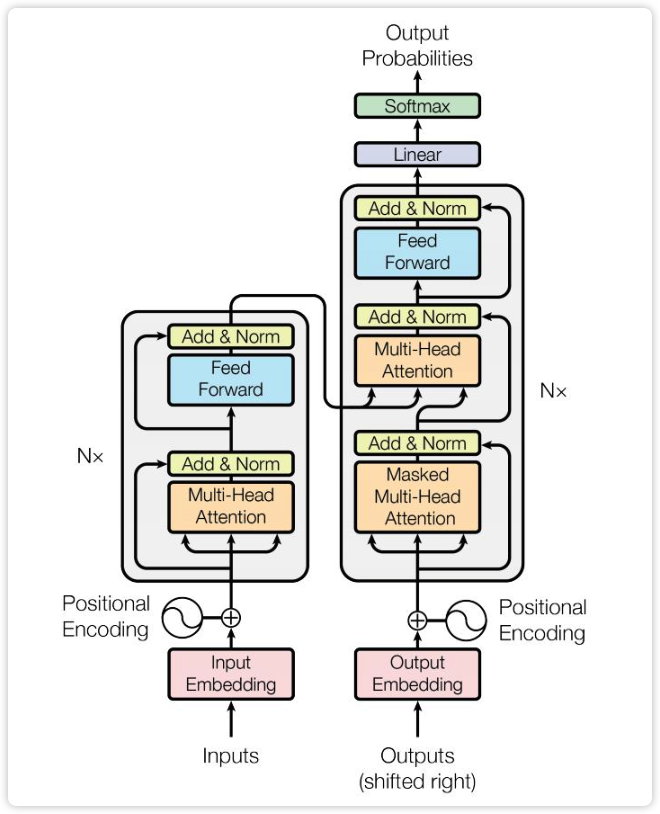
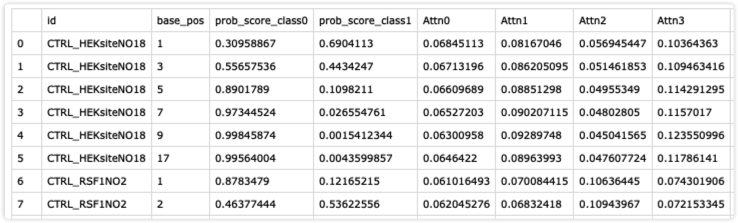
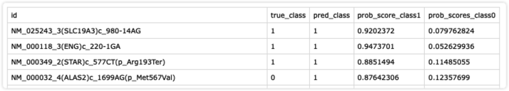
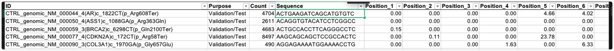
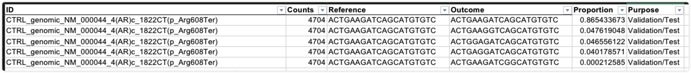
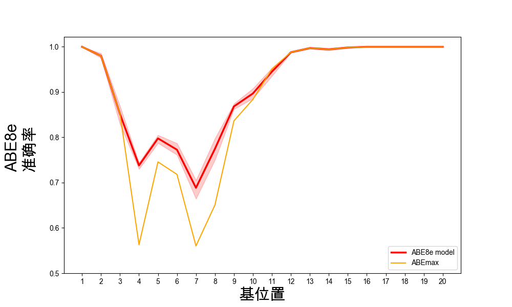
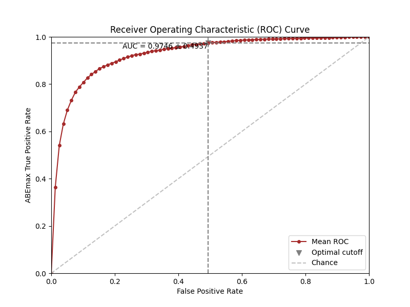
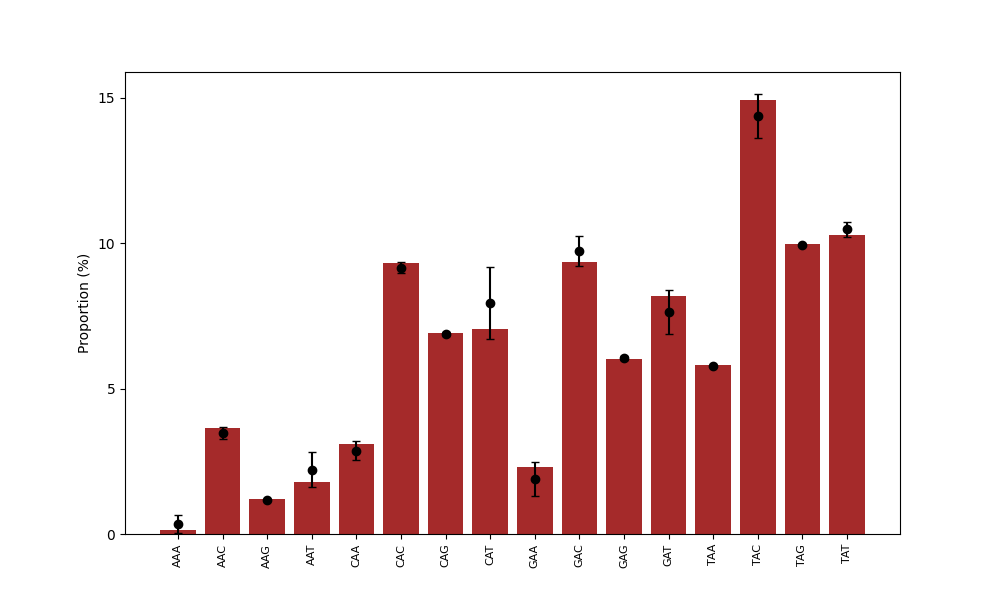
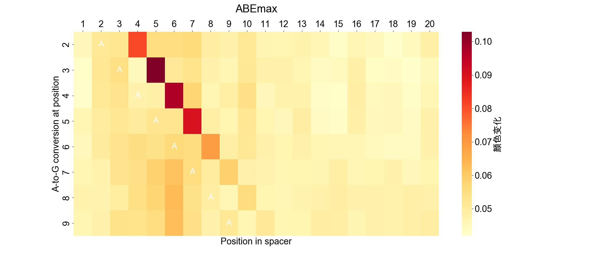

# 碱基编辑结果预测


## 当前问题




电影院上映的电影很糟糕 好/坏

电影院 好/坏

电影 好/坏

判断一段序列中A 是否会被编辑

判断一句中的名词是否是正向的









```python
loss = loss_func(logsoftmax_scores, y_batch) 
```


旁编辑




[jarrycf/BEtools: 基于多种深度学习算法对碱基编辑结果预测的研究 (github.com)](https://github.com/jarrycf/BEtools)


[Sequence-specific prediction of the efficiencies of adenine and cytosine base editors | Nature Biotechnology](https://www.nature.com/articles/s41587-020-0573-5)


[Deep learning models to predict the editing efficiencies and outcomes of diverse base editors | Nature Biotechnology](https://www.nature.com/articles/s41587-023-01792-x)


## 作图


-20230612104609446.(null))

-20230612104609447.(null))

-20230612104609445.(null))

-20230612104609486.(null))










# 


## 基于多种深度学习算法对碱基编辑结果预测的研究


## 摘要

碱基编辑器，包括腺嘌呤碱基编辑器（ABE）1和胞嘧啶碱基编辑器（CBE） （3，4），分别可以执行腺嘌呤（A）到鸟嘌呤（G）和胞嘧啶 (C) 到胸腺嘧啶（T）的的编辑，被广泛用于诱导点突变。然而，由于不同的基因组位点上存在广泛的编辑效率差异， 确定能够编辑的特定核苷酸需要耗时耗力的实验。本文基于先前研究的大量数据库，同时评估了不同的深度学习算法在基因编辑结果预测任务上的性能. 通过基于多头自注意力机制算法的大量调优, 建立碱基编辑结果预测系统BEtools， 能够以高精度预测碱基编辑的结果。


## 正文


先前研究人员设计了一种方法，可以将数万个编辑模板及其相应的编辑 gRNA 整合到细胞染色体中。然后收集编辑结果，用于基于序列上下文分析、学习和预测编辑结果 , 有了如此大的数据集和先进的学习模型，CBE 和 ABE 编辑结果可以在一定程度上进行预测， 同时先前的研究也证明了在使用同一种碱基编辑酶对同一库细胞进行转染和编辑的情况下，得到的目标碱基的编辑效率具有很高的一致性。 且不同类型的碱基编辑酶（ABEmax，CBE4max，ABE8e，和Target-AID）对于不同位点的编辑效率和偏好有明显区别。(1.Arbab et al., 2020; Song et，2. kim.F ）

此外，这些编辑酶在目标位点附近的核酸环境也会影响其编辑效率和偏好。然而，现有的预测CRISPR/Cas9 sgRNA活性的特征，如sgRNA的GC含量和最小Gibbs自由能，并不影响碱基编辑率。这些因素都使得预测任何给定目标位点的碱基编辑结果变得复杂和挑战性。这就说明了设计和训练一个机器学习模型来准确预测碱基编辑的结果的必要性。我们设计的模型将会利用全面的碱基编辑数据来进行学习和训练，并可以考虑多个因素，包括编辑酶类型、目标位点位置、以及附近的核酸环境等等。这个模型的训练将会使我们更准确地预测和控制基因编辑的结果，提高基因编辑的效率和精度，促进基因疗法的应用。

在此想法的基础上，我们测试了不同深度学习算法的在此任务上的性能，最终基于改良后的Transformer的多头自注意力机制算法了BEtools（通过提供特定编辑器数据，能够准确预测任意碱基编辑器的通用工具）。考虑到实验的可复现性以及数据的多样性，本文基于Kim F. 提供的数据集评估模型，该数据库将含有sgRNA和目标序列的寡核苷酸，克隆到慢病毒骨架中，并将其感染到HEK293T细胞中。再将细胞转染到含有四种常用碱基编辑酶的Tol2兼容质粒。通过共转染Tol2转座酶质粒，实现了碱基编辑酶的稳定整合和长期表达，最后通过高通量测序分析了转染后10天的细胞基因组， 从而得到了的包括23,123个随机生成的目标序列和5,171个具有点突变的疾病相关人类位点的综合机器学习库（2）。

本文的主要贡献有 

以下 ３ 点：

(1) 通过深度学习算法对碱基编辑结果进行了准确预测, 减少了耗时耗力的实验

(2) 评估了主流的多种深度学习模型在碱基编辑结果预测任务上的性能

(3) 为提高预测精度对于多头自注意力机制算法进行了大量改进和调优


## 关键词

注意力机制, 碱基编辑器, 深度学习


## 1 相关工作

受以上研究启发, 本文分别使用TextCNN, TextRNN, Transformer, Bert架构来对碱基编辑结果进行预测


## 2 基于多头自注意力机制的碱基编辑结果预测算法

2.2 数据预处理

首先我们获得数据的掩码位置, 再计算每个被编辑的概率进行划分为被编辑或未被编辑. 按数据索划分数据集, 将划分得到的数据索引传入dataset, 按照集成学习方进行复制, 验证每份数据集是否存在交集,  然后设置类别权重, 我们还进行了超参数搜索, 我们设置模型训练所需


2.4 模型设计


2.5 模型训练

都采样了交叉熵作为我们的学习率, 对于二分类任务采用了最大似然, 然后经过使用了循环学习率来进行学习, 


2.6 模型评估方法

f1, 准确率


2.7 其他模型架构

CNN

RNN


## 3 实验

为什么选择多头

对(adam, SGd)对比

超参数选择

反向传播的droup

下步优化


3.1 实验流程


3.2 实验评估标准


3.3 实验参数设定


3.4 实验结果与分析


## 4 结束语


## 参考文献

(1)Gaudelli, N. M. et al. Programmable base editing of A*T to G*C in genomic DNA without DNA cleavage. Nature 551, 464–471 (2017).

(2)Komor, A. C., Kim, Y. B., Packer, M. S., Zuris, J. A. & Liu, D. R. Programmable editing of a target base in genomic DNA without double-stranded DNA cleavage. Nature 533, 420–424 (2016).

(3). Nishida, K. et al. Targeted nucleotide editing using hybrid prokaryotic and vertebrate adaptive immune systems. Science 353, pii: aaf8729 (2016).

(1)Vaswani, A. et al. Attention is all you need. In Advances in neural information processing systems, pp. 5998-6008 (2017).


## 模型算法部分latex练习

### Per-base Model Overview

We designed and implemented a multi-head self-attention model (named BE-DICT) inspired by the Transformer [5] encoder architecture. BE-DICT is implemented in PyTorch [6] and takes a sequence of nucleotides (i.e. using protospacer sequence of $20 \mathrm{bp}$ window) as input and computes the probability of editing for each target nucleotide as output. The target nucleotides in our experiments were base $A$ for ABEmax and ABE8e editors, and $C$ for CBE4max and Target-AID base editors respectively.

The model has three main blocks: An (1) Embedding block that embeds both the nucleotide's and its corresponding position from one-hot encoded representation to a dense vector representation.

An (2) Encoder block that contains (a) a self-attention layer (with multi-head support), (b) layer normalization \& residual connections $(\rightarrow)$, and $(c)$ feed-forward network.

Lastly, an (3) Output block that contains (a) a position attention layer and (b) a classifier layer.

A formal description of each component of the model is described in their respective sections below.

\section{$1.2 \quad$ Embedding Block}
Formally, given a protospacer sequence $\underline{S}=\left[x_{1}, x_{2}, \cdots, x_{T}\right]$, a nucleotide at position $t$ is represented by 1-of- $K$ encoding where $K$ is the size of the set of all nucleotide letters in the data such that $x_{t} \in[0,1]^{K}$. An embedding matrix $W_{e}$ is used to map the input $x_{t}$ to a fixed-length vector representation (Eq. 1)

$$
e_{t}=W_{e} x_{t}
$$

where $W_{e} \in \mathbb{R}^{d_{e} \times K}, e_{t} \in \mathbb{R}^{d_{e}}$, and $d_{e}$ is the dimension of vector $e_{t}$.

Similarly, each nucleotide's position $p_{t}$ in the sequence $\underline{S}$ is represented by 1-of- $T$ encoding where $T$ is the number of elements in the sequence (i.e. length of protospacer sequence) such that $p_{t} \in[0,1]^{T}$. An embedding matrix $W_{p^{\prime}}$ is used to map the input $p_{t}$ to a fixed-length vector representation (Eq. 2)

$$
p_{t}^{\prime}=W_{p^{\prime}} p_{t}
$$

where $W_{p^{\prime}} \in \mathbb{R}^{d_{p^{\prime}} \times T}, p_{t}^{\prime} \in \mathbb{R}^{d_{p^{\prime}}}$ and $d_{p^{\prime}}$ is the dimension of vector $p_{t}^{\prime}$ such that $d_{e}$ and $d_{p^{\prime}}$ were equal (denoted by $d$ from now on).

Both embeddings $e_{t}$ and $p_{t}^{\prime}$ were summed (Eq. 3) to get a unified representation for every element in the sequence $\underline{S}$ (i.e. compute a new sequence $\underline{U}=\left[u_{1}, u_{2}, \cdots, u_{T}\right]$ where $u_{t} \in \mathbb{R}^{d}, \forall t \in[1, \cdots, T]$ ).

$$
u_{t}=e_{t}+p_{t}^{\prime}
$$

\subsection{Encoder Block}
\subsubsection{Self-Attention Layer}
We followed a multi-head self-attention approach where multiple single-head self-attention layers are used in parallel (i.e. simultaneously) to process each input vector $u_{t}$. The outputs from every single-head layer are concatenated and transformed to generate a fixed-length vector using an affine transformation. The single-head self-attention approach [5] performs linear transformation to the input vector using three separate matrices: (1) a queries matrix $W_{\text {query }}$, (2) keys matrix $W_{\text {key }}$, and (3) values matrix $W_{\text {value }}$. Each input $u_{t}$ in $\underline{U}$ is mapped using these matrices to compute three new vectors (Eq. 4, 5, and 6 )

$$
\begin{gathered}
q_{t}=W_{\text {query }} u_{t} \\
k_{t}=W_{\text {key }} u_{t} \\
v_{t}=W_{\text {value }} u_{t}
\end{gathered}
$$

where $W_{\text {query }}, W_{\text {key }}, W_{\text {value }} \in \mathbb{R}^{d^{\prime} \times d}, q_{t}, k_{t}, v_{t} \in \mathbb{R}^{d^{\prime}}$ are query, key and value vectors, and $d^{\prime}$ is the dimension of the three computed vectors respectively. In a second step, attention scores are computed using the pairwise similarity between the query and key vectors for each position $t$ in the sequence. The similarity is defined by computing a scaled dot-product between the pairwise vectors. At each position $t$, we compute attention scores $\alpha_{t l}$ representing the similarity between $q_{t}$ and vectors $k_{l} \forall l \in[1, \ldots, T]$ (Eq. 7, 8) normalized using softmax function. Then a weighted sum using the attention scores $\alpha_{t l}$ and value vectors $v_{l} \forall l \in[1, \ldots, T]$ is performed (Eq. 9) to generate a new vector representation $z_{t} \in \mathbb{R}^{d^{\prime}}$ at position $t$. This process is applied to every position in the sequence $\underline{U}$ to obtain a sequence of vectors $\underline{Z}=\left[z_{1}, z_{2}, \cdots, z_{T}\right]$.

$$
\begin{gathered}
\alpha_{t l}=\frac{\exp \left(\operatorname{score}\left(q_{t}, k_{l}\right)\right)}{\sum_{l=1}^{T} \exp \left(\operatorname{score}\left(q_{t}, k_{l}\right)\right)} \\
\operatorname{score}\left(q_{t}, k_{l}\right)=\frac{q_{t}^{\top} k_{l}}{\sqrt{d}} \\
z_{t}=\sum_{l=1}^{T} \alpha_{t l} v_{l}
\end{gathered}
$$

In a multi-head setting with $H$ number of heads, the queries, keys and values matrices will be indexed by superscript $h$ (i.e. $W_{\text {query }}^{h}, W_{\text {key }}^{h}, W_{\text {value }}^{h} \in \mathbb{R}^{d^{\prime} \times d}$ ) and applied separately to generate a new vector representation $z_{t}^{h}$ for every single-head self-attention layer. The output from each single-head layer is concatenated into one vector $z_{t}^{\text {concat }}=\operatorname{concat}\left(z_{t}^{1}, z_{t}^{2}, \cdots, z_{t}^{H}\right)$ where $z_{t}^{\text {concat }} \in \mathbb{R}^{d^{\prime} H}$ and then transformed using affine transformation (Eq. 10 such that $W_{\text {unify }} \in \mathbb{R}^{d^{\prime} \times d^{\prime} H}$ and $b_{\text {unify }} \in \mathbb{R}^{d^{\prime}}$. This process is applied to each position in the sequence $\underline{Z}$ to generate a sequence $\underline{\tilde{Z}}=\left[\tilde{z}_{1}, \tilde{z}_{2}, \cdots, \tilde{z}_{T}\right]$.

$$
\tilde{z_{t}}=W_{\text {unify }} z_{t}^{\text {concat }}+b_{\text {unify }}
$$

\subsubsection{Layer Normalization \& Residual Connections}
We used residual connections / skip-connections $(\rightarrow)[7]$ in order to improve the gradient flow in layers during training. This is done by summing both the newly computed output of the current layer with the output from the previous layer. In our setting, a first residual connection sums the output of the self-attention layer $\tilde{z}_{t}$ and the output of embedding block $u_{t}$ for each position $t$ in the sequence. We will refer to the summed output by $\tilde{z}_{t}$ for simplicity.

Layer normalization [8] was used in two occasions; after the self-attention layer and feed-forward network layer with the goal to ameliorate the "covariate-shift" problem by re-standardizing the computed vector representations (i.e. using the mean and variance across the features/embedding dimension $d^{\prime}$ ). Given a computed vector $\tilde{z}_{t}$, LayerNorm function will standardize the input vector using the mean $\mu_{t}$ and variance $\sigma_{t}^{2}$ along the features dimension $d^{\prime}$ and apply a scaling $\gamma$ and shifting step $\beta$ (Eq. 13). $\gamma$ and $\beta$ are learnable parameters and $\epsilon$ is small number added for numerical stability.

$$
\begin{gathered}
\mu_{t}=\frac{1}{d^{\prime}} \sum_{j=1}^{d^{\prime}} \tilde{z}_{t j} \\
\sigma_{t}^{2}=\frac{1}{d^{\prime}} \sum_{j=1}^{d^{\prime}}\left(\tilde{z}_{t j}-\mu_{t}\right)^{2} \\
\operatorname{LayerNorm}\left(\tilde{z}_{t}\right)=\gamma \times \frac{\tilde{z}_{t}-\mu_{t}}{\sqrt{\sigma_{t}^{2}+\epsilon}}+\beta
\end{gathered}
$$

\subsubsection{FeedForward Layer}
After a layer normalization step, a feed-forward network consisting of two affine transformation matrices and non-linear activation function is used to further compute/embed the learned vector representations from previous layers. The first transformation (Eq. 14 uses $W_{M L P 1} \in \mathbb{R}^{\xi d^{\prime} \times d^{\prime}}$ and $b_{M L P 1} \in \mathbb{R}^{\xi d^{\prime}}$ to transform input $\tilde{z_{t}}$ to new vector $\in \mathbb{R}^{\xi d^{\prime}}$ where $\xi \in \mathbb{N}$ is multiplicative factor. A non-linear function such as $\operatorname{ReLU}(z)=\max (0, z)$ is applied followed by another affine transformation using $W_{M L P 2} \in \mathbb{R}^{d^{\prime} \times \xi d^{\prime}}$ and $b_{M L P 2} \in R^{d^{\prime}}$ to obtain vector $r_{t} \in \mathbb{R}^{d^{\prime}}$. A layer normalization (Eq. 15 is applied to obtain $\tilde{r}_{t} \in \mathbb{R}^{d^{\prime}}$.

$$
r_{t}=W_{M L P 2} \operatorname{Re} L U\left(W_{M L P 1} \tilde{z}_{t}+b_{M L P 1}\right)+b_{M L P 2}
$$

$$
\tilde{r}_{t}=\operatorname{Layer} \operatorname{Norm}\left(r_{t}\right)
$$

These transformations are applied to each vector in sequence $\underline{\tilde{Z}}$ to obtain new sequence $\underline{R}=\left[\tilde{r}_{1}, \tilde{r}_{2}, \cdots, \tilde{r}_{T}\right]$. At this point, the encoder block operations are done and multiple encoder blocks can be stacked in series for $E$ number of times. In our experiments, $E$ was a hyperparameter that was empirically determined using a validation set (as the case of the number of attention heads $H$ used in self-attention layer).

\subsection{Output Block}
\subsubsection{Position Attention Layer}
The position attention layer is parametrized by a set of global context vectors $\underline{C}=\left[c_{1}, c_{2}, \cdots, c_{T}\right]$ corresponding to each position in the protospacer sequence. These context vectors are learnable parameters optimized during the training. For a target base at position $t$, attention scores $\psi_{t} \forall t \in[1, \cdots, T]$ are calculated using the pairwise similarity between the context vector $c_{t} \in \mathbb{R}^{d^{\prime}}$ with the vectors representing every position in the protospacer sequence $\left(\left[\tilde{r}_{1}, \tilde{r}_{2}, \cdots, \tilde{r}_{T}\right]\right.$ computed in the previous layer (Eq. 16, 17). These scores are normalized and used to compute weighted sum of the $\left[\tilde{r}_{1}, \tilde{r}_{2}, \cdots, \tilde{r}_{T}\right]$ vectors to generate a new vector representation $o_{t} \in \mathbb{R}^{d^{\prime}}$ at position $t$. This process is done at each target position to generate a sequence $\underline{O}=\left[o_{1}, o_{2}, \cdots, o_{T}\right]$ that is further passed to the classifier layer.

$$
\begin{gathered}
\psi_{t}=\frac{\exp \left(\operatorname{score}\left(c_{t}, \tilde{r}_{t}\right)\right)}{\sum_{j=1}^{T} \exp \left(\operatorname{score}\left(c_{t}, \tilde{r}_{j}\right)\right)} \\
\operatorname{score}\left(c_{t}, \tilde{r}_{t}\right)=\frac{c_{t}^{\top} \tilde{r}_{t}}{\sqrt{d^{\prime}}} \\
o_{t}=\sum_{t=1}^{T} \psi_{t} \tilde{r}_{t}
\end{gathered}
$$

\subsubsection{Output Classifier}
The last layer in the model takes as input the computed representation vectors $\underline{O}=\left[o_{1}, o_{2}, \cdots, o_{T}\right]$ from the position attention layer and performs an affine transformation followed by softmax operation to compute a probability distribution on the outcomes (i.e. edit vs. no edit) for every target base under consideration (i.e. base $A$ or $C$ ). That is, the probability distribution $\hat{y}_{t}$ at position $t$ is computed using Eq. 19

$$
\hat{y}_{t}=\sigma\left(W_{o} o_{t}+b_{o}\right)
$$

where $W_{o} \in \mathbb{R}^{\mid V_{\text {outcome }} \times d^{\prime}}, b_{o} \in \mathbb{R}^{\left|V_{\text {outcome }}\right|}, V_{\text {outcome }} \in\{0,1\}$ is the set of admissible labels (binary variable in our case). Moreover, $\left|V_{\text {outcome }}\right|$ is the number of labels, $d^{\prime}$ is the dimension of $o_{t}$ and $\sigma$ is the softmax function.

\subsection{Objective Function}
We defined the loss for an $i$-th sequence at each position $t$ by the cross-entropy loss

$$
l_{t}^{(i)}=-\sum_{c=1}^{\left|V_{\text {outcome }}\right|} y_{t, c}^{(i)} \times \log \left(\hat{y}_{t, c}^{(i)}\right)
$$

where the loss for the $i$-th sequence is defined by the average loss over the sequence length $T$

$$
L_{i}=\frac{1}{T} \sum_{t=1}^{T} l_{t}^{(i)}
$$

Given that our focus is on target nucleotides (i.e. bases $A$ or $C$ depending on the base editor used), our model's focus should be on positions where target bases occur. Hence, we modify the defined loss over $i$-th sequence (see Eq. 21) by defining an average loss for target base $L_{i}^{\text {target }}$ (Eq. 22

$$
L_{i}^{\text {target }}=\frac{1}{\sum_{t=1}^{T} \mathbb{1}\left[x_{t, \text { base }}^{(i)}=1\right]} \sum_{t=1}^{T} l_{t}^{(i)} \mathbb{1}\left[x_{t, \text { base }}^{(i)}=1\right]
$$

where $\mathbb{1}\left[x_{t, b a s e}^{(i)}=1\right]$ is an indicator function that is equal to 1 when $x_{t}^{i}$ representing the nucleotide at position $t$ for the $i$-th sequence is the target base (i.e. $A$ for ABEmax and ABE8e and $C$ for CBE4max and Target-AID base editors respectively). Lastly, the objective function for the whole training set $D_{\text {train }}$ is defined by the average loss across all the sequences in $D_{\text {train }}$ plus a weight regularization term (i.e. $l_{2}$-norm regularization) applied to the model parameters represented by $\theta$

$$
L(\boldsymbol{\theta})=\frac{1}{N} \sum_{i=1}^{N} L_{i}^{\text {target }}+\frac{\lambda}{2}\|\boldsymbol{\theta}\|_{2}^{2}
$$

In practice, the training occurs using mini-batches where computing the loss function and updating the parameters/weight occur after processing each mini-batch of the training set.

\section{Supplementary Note 2: Bystander Model}
We next developed a bystander variation of the BE-DICT model, which is capable of predicting the relative proportions of different editing outcomes (combinations of target base and bystander conversions) per target locus (BE-DICT bystander module). The model is based on an encoder-decoder architecture (adapting the Transformer architecture used in the BE-DICT per-base model), which takes a sequence of nucleotides of the protospacer as input, and computes probabilities for all combinations of sequences with target-base and bystander transitions, as well as the probability of observing a wild-type sequence. The model uses similar Embedding and Encoder blocks (see sections 1.2 and 1.3 in the per-base model) for processing the input sequence (i.e. protospacer). Additionally, the model has a Decoder block that is used to compute the probability of the different editing outcome sequences (i.e. relative proportion of combinations of target base and bystander transitions).

\subsection{Embedding \& Encoder Block}
Similar to the per-base model setting, the bystander model takes as input a protospacer sequence $\underline{S}=$ $\left[x_{1}, x_{2}, \cdots, x_{T}\right]$, where a nucleotide at position $t$ is represented by 1 -of- $K$ encoding and $K$ is the size of the set of all nucleotide letters in the data such that $x_{t} \in[0,1]^{K}$. The sequence is passed to Embedding and Encoder blocks (see sections 1.2 and 1.3 to generate a new sequence of vectors denoted by $\underline{Z}=\left[\tilde{z}_{1}, \tilde{z}_{2}, \cdots, \tilde{z}_{T}\right]$ as an output. As before, multiple encoder blocks can be stacked and applied in series to generate the new sequence representation $\underline{Z}$.

\subsection{Embedding \& Decoder Block}
The list of observed experimental edit combinations of the target nucleotides for every protospacer sequence $\underline{S}$ is used as input to the Decoder block. The edit combinations included canonical conversions corresponding to the chosen base editor (i.e. A->G conversions for ABEmax and ABE8e editors, and $\mathrm{C}->$ T conversions for CBE4max and Target-AID editors). A $j$-th output sequence is denoted by $O_{j}=\left[o_{j 1}, o_{j 2}, \cdots, o_{j T}\right]$ where $j$ indexes the list of observed edit combination sequences for the given input protospacer sequence.

Every output sequence $O_{j}$ is passed to an Embedding block that embeds both the nucleotides and their corresponding position from one-hot encoded representation to a dense vector representation obtaining a new sequence $B_{j}$ (similar to section 1.2 .

Subsequently, a masked self-attention layer is used as an "autoregressive layer" to ensure the use of past information only while computing the new vector representation at each step in the sequence $E_{j}=$ $\left[e_{j 1}, e_{j 2}, \cdots, e_{j T}\right]$. Layer normalization and residual connections are used (similar to section 1.3 .2 above) to obtain a sequence of vectors $V_{j}$.

The sequence $V_{j}$ is later passed to a cross-attention layer such that the vectors in $V_{j}$ were used as queries, and the vectors in $\underline{Z}$ (the computed sequence from the Encoder block) as keys to compute the attention scores (i.e. pairwise similarity using scaled dot-product) between the query and key vectors. These scores are used to weigh the vectors in $V_{j}$ when computing the new sequence representation $D_{j}=\left[d_{j 1}, d_{j 2}, \cdots, d_{j T}\right]$.

Then a series of layer normalization, residual connections followed by feed-forward network are used to compute the penultimate sequence representation $\underline{H_{j}}=\left[h_{j 1}, h_{j 2}, \cdots, h_{j T}\right]$ (i.e. before passing it to the output block). Multiple decoder blocks can be stacked and applied in series to generate the new sequence representation $H_{j}$.

To summarize, the Decoder block consists of the following layers in this order: Masked Self-Attention, Add+Normalize, Cross-Attention, Add+Normalize, Feed-Forward, Add+Normalize.

\subsection{Output block}
The last layer in the model takes as input the computed representation $H_{j}=\left[h_{j 1}, h_{j 2}, \cdots, h_{j T}\right]$ (i.e. sequence of vectors) from the Decoder block and performs an affine transformation followed by softmax operation to compute the probability of conversion for every target base (i.e. base $A$ or $C$ depending on the chosen base editor) in the $j$-th outcome sequence under consideration (Eq. 24

$$
\hat{y}_{j t}=\sigma\left(W h_{j t}+b_{t}\right)
$$

where $W \in \mathbb{R}^{2 \times d^{\prime}}, b_{t} \in \mathbb{R}^{2}, h_{j t} \in \mathbb{R}^{d^{\prime}}$ and $\sigma$ is the softmax function.

The probability of the whole outcome sequence $\hat{y}_{j}$ (i.e. $j$-th edit combination) is computed using Eq. 25

$$
\hat{y}_{j}=\prod_{t=1}^{T} \hat{y}_{j t}
$$

\subsection{Objective Function}
Kullback-Leibler divergence (KL-div) was used as a loss function for an $i$-th input sequence (i.e. protospacer). KL-div represents the relative entropy of the model's estimated distribution over all outcome sequences $\hat{y}_{j}$ with respect to the true distribution (i.e. observed proportions of editing outcomes) $y_{j}$ for $j \in[1, \cdots, J]$ and $J$ representing the number of edited outcome sequences for a given protospacer sequence (Eq. 26).
$$
D_{K L-d i v}^{i}\left(y^{i} \| \hat{y}^{i}\right)=\sum_{j=1}^{J} y_{j}^{i} \log \left(\frac{y_{j}^{i}}{\hat{y}_{j}^{i}}\right)
$$

Lastly, the objective function for the whole training set is defined by the average loss across all the input protospacer sequences plus a weight regularization term (i.e. $l_{2}$-norm regularization) applied to the model parameters represented by $\theta$


$$
L(\mathbf{\theta})=\frac{1}{N} \sum_{i=1}^{N} D_{K L-d i v}^{i}\left(y^{i} \| \hat{y}^{i}\right)+\frac{\lambda}{2}\|\mathbf{\theta}\|_{2}^{2}
$$

In practice, the training occurs using mini-batches where computing the loss function and updating the parameters/weight occur after processing each mini-batch of the training set.

\section{Supplementary Note 3:}
Experiments for machine learning

\subsection{Training \& Evaluation Workflow}
For model training (per-base and bystander) we used $\approx 80 \%$ of the dataset consisting of randomized-DNA target sequences, and performed stratified random splits for the rest of the sequences to generate an equal ratio (1:1) between test and validation datasets. We repeated this process five times (denoted by runs), in which we trained and evaluated a model for each base editor separately for each run.

\subsubsection{Per-base Model}
For the per-base model, training examples were weighted inversely proportional to class/outcome frequencies in the training data. BE-DICT performance was evaluated using area under the receiver operating characteristic curve (AUC), and area under the precision recall curve (AUPR). During training of the models, the epoch in which the model achieved the best AUPR on the validation set was recorded, and model state as it was trained up to that epoch was saved. This best model, as determined by the validation set, was then tested on the test split. The evaluation of the trained models for each base editor was based on their average performance on the test sets across the five runs.

We further compared BE-DICT's per position accuracy with a majority class predictor (one for each base editor) that uses the training data to estimate the per position prior (i.e. base rate) probability of having a target base edited. Based on the estimated prior, the predictor assigns the majority class (one with higher probability) as the outcome for the target base at the position under consideration.

\subsubsection{Bystander Model}
The bystander model performance was evaluated using Pearson and Spearman correlation. During training of the models, the epoch in which the model achieved the best harmonic mean between both scores on the validation set was recorded, and model state as it was trained up to that epoch was saved. This best model, as determined by the validation set, was then tested on the test split. The evaluation of the trained models for each base editor was based on their average performance on the test sets across the five runs.

\subsection{Hyperparameters Optimization}
We used a uniform random search strategy [9] that randomly chose a set of hyperparameters configurations (i.e. embedding dimension, number of attention heads, dropout probability, etc.) from the set of all possible configurations. Then the best configuration for each model (i.e. the one achieving best performance on the validation set) was used for the final training and testing.

The range of possible hyperparameters configuration (i.e. choice of values for hyperparameters) for BE-DICT models is reported in Tables 1 and 2 for per-base and bystander model respectively. In our experiments, there was an overlap between the best hyperparameter configurations for the different models trained on the various base editors. Hence, we opted for a common hyperparameter configuration among the trained models.

List 1 BE-DICT (per-base) hyperparameters options


渲染出错


$$
L(\boldsymbol{\theta})=\frac{1}{N} \sum_{i=1}^{N} D_{K L-d i v}^{i}\left(y^{i} \| \hat{y}^{i}\right)+\frac{\lambda}{2}\|\boldsymbol{\theta}\|_{2}^{2}
$$


## 代码可用性


[jarrycf/BEtools: 基于多种深度学习算法对碱基编辑结果预测的研究 (github.com)](https://github.com/jarrycf/BEtools)
